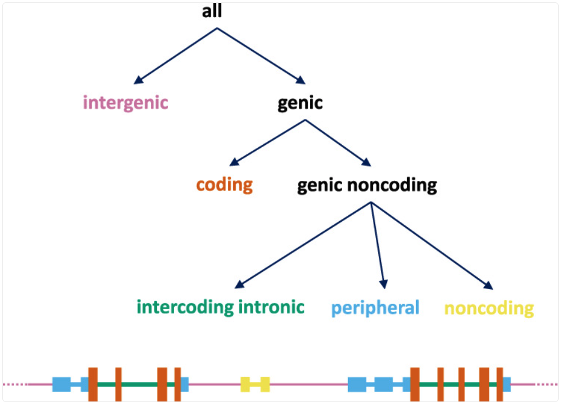
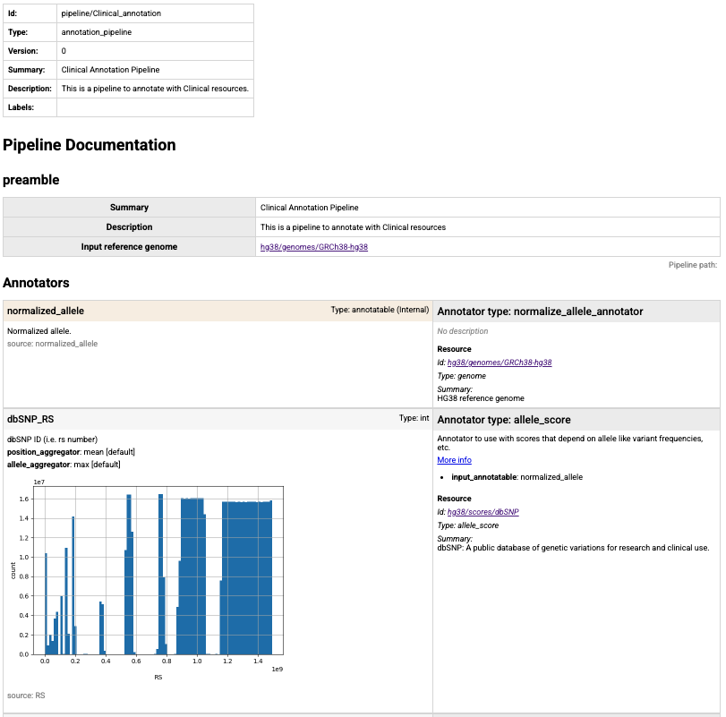

Annotation infrastructure
=========================

Annotation is a central step in genomic analysis. Sequencing and other genomic assays identify variants, 
positions, or regions, and annotation adds the biological and clinical context needed to interpret them. 
With annotation in place, these genomic inputs can be searched, filtered, and prioritized in a consistent and reproducible way.

GAIn is a flexible infrastructure for annotating variants, positions, and regions. 
Annotation is performed using a user-provided specification called an annotation pipeline.

Annotation pipelines
-----------------------

Annotation pipelines are YAML files with a defined structure: an optional 
preamble followed by an ordered list of annotators. For each annotator, the user 
specifies the annotator type, points to the required resources by ID, chooses the 
annotatable to operate on, sets any additional parameters as needed, and selects which 
attributes to emit in the output. 

To define an annotator, you simply start by declaring the annotator type 
from the available annotator types (e.g. ``effect_annotator``, ``gene_score_annotator``), 
and then specify the settings for that annotator type as a YAML dictionary. 
The exact settings depend on the annotator type. The typical structure of an annotator 
declaration is shown below.

.. code:: yaml

    - <annotator type>
      # annotator settings

Many annotators share a small set of common fields. 
``input_annotatable`` selects which annotatable object to use as input (by default, 
this is the annotatable read from the input file). For gene-focused annotators, ``input_gene_list`` 
specifies the gene list used to match annotatables to genes. An annotatable is the genomic 
object that annotators operate on. Some annotators produce a new annotatable 
(for example after liftover or allele normalization) that can be passed downstream 
to later annotators. 

Annotators typically specify the resources they use by fields 
like ``resource_id``, ``genome``, and ``gene_models``, depending on the annotator type.

Annotators typically have an attributes field which defines 
the attributes that will be added to the annotation by GAIn. 
If this is omitted then the default annotation specified in the resource is used.

The attributes section has the following minimal structure, which only specifies the source attribute in the resource:

.. code:: yaml

    attributes:
    - source: <source attribute>

attributes section has two optional fields. 

    | **name**: the user may rename the resource attribute to a different name in the annotation output. If not specified, source attribute name is used in the output.
    | **internal**: the user can choose to compute an attribute but not include it in the output. This is useful when an attribute is needed as input to a later annotator but is not of interest to the user. If internal is set to true, that attribute will be computed but not written to the annotation output. The default value for internal is false, meaning that attributes are included in the output by default.

Different annotator types have different configurations, and we will discuss them below. First, we will talk about the preamble section.

Preamble
-----------------------

In addition to the ordered list of annotators, an annotation pipeline 
config may include an optional ``preamble`` section. The preamble records 
high-level information about the pipeline that is useful for human readers 
and documentation tools.

A key preamble field is ``input_reference_genome``. Many resources are reference-genome-specific, 
so declaring the genome once allows annotators to reuse it without repeating the 
same setting throughout the pipeline. If an annotator specifies its own genome, 
that value overrides the preamble's ``input_reference_genome``.

When a preamble is present, annotators must be listed under the ``annotators`` key. 
Below is an annotation pipeline draft that includes a preamble section. 

.. code:: yaml

    preamble:
      summary: my_summary
      description: my_description
      input_reference_genome: my_genome
      metadata:
        author: my_name
        customField: "Any arbitrary key/value pairs can go here."
        customNestedDictionary:
          key1: value1

    annotators:
    - position_score_annotator: 
        resource_id: <position score resource ID>
        attributes:
        - source: <source_score_attribute>
          name: <renamed_score_attribute>

Annotators
------------------------

Annotators are the individual components that make up an annotation pipeline. 
Each annotator takes an input object (an annotatable, such as the annotatable read from 
the input file, or a derived annotatable produced by an earlier annotator), uses 
one or more resources and settings, and produces outputs in the form of annotation 
attributes and, in some cases, a new annotatable for downstream use. For that reason, 
annotators are best understood by what they consume (which annotatable or gene list 
they operate on) and what they produce (annotation attributes, gene context, or a 
transformed annotatable).

In the sections below, we group annotators by their role in the pipeline: 
score-based annotators, effect annotators that derive 
gene and transcript context, annotators that produce new annotatables for downstream 
annotation, gene set annotators for set membership, and plugin-based annotators such as SpliceAI.

Score annotators
^^^^^^^^^^^^^^^^^^^^^

Score annotators attach values from score resources to each input annotatable 
and emit them as annotation attributes. In some cases, a single annotatable can match 
multiple score records (for example due to overlapping intervals or multi-base events). 
Aggregators define how these multiple values are combined into a single output value. 
Available aggregators are ``mean``, ``median``, ``max``, ``min``, ``mode``, ``join`` (i.e.,
``join(;)``), ``list``, and ``concatenate``.

position_score_annotator
************************

A ``position_score_annotator`` adds locus-level context to each annotatable by looking up values from a position score resource at 
the annotatable's genomic coordinates. Position score resources assign per-base metrics to fixed genomic positions independent of 
the observed allele, providing signals such as evolutionary conservation or functional constraint (for example, phyloP and phastCons).

A minimal ``position_score_annotator`` configuration is shown below. 
This annotator looks up the value of the source attribute from the specified position score resource and adds it to the annotation output as an attribute with the same name.

.. code:: yaml

    - position_score_annotator:
        resource_id: <position score resource ID>
        attributes:
        - source: <source_score_attribute>

An annotatable may overlap multiple positions or intervals in
the underlying score resource (for example, an INDEL spans
multiple bases). In these cases, the annotator combines the
matched values using a single aggregation setting, ``aggregator``.
The example below uses an ``aggregator`` and also renames the output attribute to ``renamed_score_attribute``.

.. code:: yaml

    - position_score_annotator:
        resource_id: <position score resource ID>
        attributes:
        - source: <source_score_attribute>
          name: <renamed_score_attribute>
          aggregator: <aggregator>

allele_score_annotator
************************

An ``allele_score_annotator`` adds allele-level context to each annotatable by looking up values from an allele score resource for a 
specific REF→ALT change (and, in some cases, local sequence context). Allele score resources capture signals such as predicted variant impact 
(for example, CADD, AlphaMissense, MPC), population-level evidence like allele frequency (for example, gnomAD), and curated clinical assertions (for example, ClinVar).

A minimal ``allele_score_annotator`` configuration is shown below:

.. code:: yaml

    - allele_score_annotator:
        resource_id: <allele score resource ID>
        attributes:
        - source: <source_score_attribute>

The ``allele_score_annotator`` operates in one of two modes, selected by the ``mode`` parameter:

  | **allele** (default): performs an exact chrom/pos/ref/alt lookup. The annotatable must be a ``VCFAllele``; other types fall back to region mode.
  | **region**: iterates all allele lines that overlap the annotatable's span and aggregates their scores. Works with any annotatable type (``VCFAllele``, ``Region``, CNV, etc.).

In ``region`` mode, the ``aggregator`` attribute parameter controls how multiple matched values are combined. If no ``aggregator`` is specified in the attribute configuration, the annotator uses the score's default ``allele_aggregator`` from the resource definition (which defaults to ``max`` for numeric scores and ``list`` for string scores).

.. code:: yaml

    - allele_score_annotator:
        resource_id: <allele score resource ID>
        mode: region
        attributes:
        - source: <source_score_attribute>
          name: <renamed_score_attribute>
          aggregator: <aggregator>

gene_score_annotator
************************

A ``gene_score_annotator`` adds gene-level context by attaching per-gene metrics to an 
annotatable after it has been mapped to one or more genes. Gene score resources summarize 
properties such as constraint, intolerance, and gene size, and are typically keyed by 
stable gene identifiers (for example, HGNC). Common examples include pLI and LOEUF, which 
reflect a gene's intolerance to loss-of-function variation, as well as scores based on gene 
length or disease association.

Unlike position and allele score annotators, a gene score annotator requires a gene 
list in the annotation context. The gene list is provided via ``input_gene_list`` and is 
typically produced by an upstream effect annotator (for example, ``gene_list`` or ``LGD_gene_list``). 
If the requested gene list is not present, the annotator cannot match annotatables to genes.

An example ``gene_score_annotator`` configuration is shown below:

.. code:: yaml

    - gene_score_annotator:
        resource_id: <gene score resource ID>
        input_gene_list: <gene list to use>
        attributes:
        - source: <source_score_attribute>
          name: <renamed_score_attribute>
          aggregator: <aggregator>

The ``aggregator`` setting controls how gene score values are combined when an annotatable
maps to multiple genes in the selected gene list.

Effect annotators
^^^^^^^^^^^^^^^^^^^^^

Effect annotators interpret each annotatable in the context of a gene model and report the 
predicted functional consequence (for example, missense, synonymous, or loss-of-function) 
along with the affected genes and transcripts. Unlike score-based annotators, which attach 
values from external resources, effect annotators derive annotation context directly from 
the annotatable and the gene models. Effect annotators require a gene models resource. 
The reference genome can be specified explicitly or inferred from the gene models 
configuration or the pipeline preamble.

Effect annotators also produce gene lists and effect summaries that can be consumed by 
downstream gene-based annotators (for example, gene scores and gene sets via ``input_gene_list``). 
GAIn provides two effect annotators: ``effect_annotator``, which evaluates a specific 
variant change and can emit detailed transcript-level output, and ``simple_effect_annotator``, 
which uses a simplified scheme that emphasizes position-based classification.

effect_annotator
************************

The ``effect_annotator`` predicts the functional consequence of a variant annotatable with respect to 
protein-coding transcripts (for example, missense, synonymous, LGD) using the provided gene models. 
It can emit both high-level summaries (such as the worst effect) and more detailed per-gene and 
per-transcript outputs.

A minimal ``effect_annotator`` configuration is shown below:

.. code:: yaml

    - effect_annotator:
        gene_models: <gene models resource ID>
        genome: <reference genome resource ID>

The ``genome`` field is optional. If it is not provided, the annotator resolves the reference genome in the following order:

  | **1. genome** specified in the annotator configuration
  | **2. reference_genome** label in the configured gene_models resource
  | **3. input_reference_genome** from the pipeline preamble

The ``effect_annotator`` can emit the following attributes:

  | **worst_effect** (default: yes): the worst effect across all transcripts.
  | **worst_effect_genes** (default: yes): comma-separated list of genes with the worst effect.
  | **gene_effects** (default: yes): effect types for each gene.
  | **effect_details** (default: yes): effect details for each affected transcript.
  | **gene_list** (internal, default: yes): list of all affected genes.
  | **worst_effect_gene_list** (internal, default: no): list of genes with the worst effect.
  | **genes** (default: no): comma-separated list of affected genes.
  | **<effect>_genes** (default: no): comma-separated list of genes with a specific effect type.
  | **<effect>_gene_list** (internal, default: no): list of genes with a specific effect type.

Gene list attributes (``gene_list``, ``worst_effect_gene_list``, and ``<effect>_gene_list``) support
aggregation. By default they are emitted as Python lists; supply an ``aggregator`` to collapse them
into a single string, for example:

.. code:: yaml

    - effect_annotator:
        gene_models: <gene models resource ID>
        attributes:
        - gene_list
        - source: gene_list
          name: genes
          aggregator: join(,)

The ``effect_annotator`` example below uses the `MANE 1.5 gene models <https://grr.iossifovlab.com/hg38/gene_models/MANE/1.5/index.html>`_ in the IossifovLab GRR.
Since this gene models resource already specifies its reference genome via its configuration labels,
the genome field is not required in the annotator configuration.
The example also renames ``worst_effect`` to ``MANE_1.5_worst_effect``.

.. code:: yaml

    - effect_annotator:
        gene_models: hg38/gene_models/MANE/1.5
        attributes:
        - source: worst_effect
          name: MANE_1.5_worst_effect

simple_effect_annotator
************************

The ``simple_effect_annotator`` assigns a coarse, position-based classification to each annotatable 
using the provided gene models. Conceptually, it first separates loci into broad 
categories such as intergenic vs genic, and then refines genic loci into coding and several 
noncoding classes (as in the scheme shown below, reproduced from `PMID: 34471188 <https://pmc.ncbi.nlm.nih.gov/articles/PMC8410909/>`_). Unlike 
effect_annotator, which evaluates the specific REF→ALT change, the simple effect annotator 
emphasizes where the locus falls relative to gene structure.

  Event types defined by the ``simple_effect_annotator``.

A minimal ``simple_effect_annotator`` configuration is shown below:

.. code:: yaml

    - simple_effect_annotator:
        gene_models: <gene models resource ID>

The output fields follow the same general pattern as ``effect_annotator`` (for example,
a “worst” class plus affected gene lists), but the effect labels reflect this simplified,
location-focused scheme. Gene list attributes support aggregation via ``aggregator`` in
the same way as ``effect_annotator``.

Transforming annotators 
^^^^^^^^^^^^^^^^^^^^^

Transforming annotators produce a new annotatable derived from the input, rather than  
adding annotation attributes. They take an annotatable, 
apply a transformation such as liftover, allele normalization, or chromosome renaming, and emit 
a new annotatable that can be passed downstream to later annotators via ``input_annotatable``. 
These annotators are commonly used to reconcile differences in reference genome, coordinate 
conventions, or chromosome naming before running additional annotation steps.

liftover_annotator
************************

The ``liftover_annotator`` maps an annotatable from one reference genome to another using a liftover chain.
Its primary output is a new annotatable in the target reference genome. By default, 
this annotatable is named ``liftover_annotatable`` and can be passed to downstream annotators via 
input_annotatable. 

The attributes section is used to rename the produced annotatable (and optionally mark 
it as internal), rather than to select score fields from a resource. A typical configuration 
is shown below. Here, the lifted-over annotatable is renamed to ``T2T_annotatable`` and marked as 
internal so it can be used downstream without appearing in the final output.

.. code:: yaml

  - liftover_annotator:
      chain: liftover/hg38_to_T2T
      source_genome: hg38/genomes/GRCh38.p14
      target_genome: t2t/genomes/t2t-chm13v2.0
      attributes:
      - source: liftover_annotatable
        name: T2T_annotatable
        internal: true

The ``source_genome`` and ``target_genome`` fields are optional. If they are not provided, 
the annotator attempts to infer them from the liftover chain resource configuration (via 
``source_genome`` and ``target_genome`` labels in the chain resource's meta section).

normalize_allele_annotator
************************

The ``normalize_allele_annotator`` converts a variant annotatable to a canonical allele representation using 
the normalization algorithm described `here <https://genome.sph.umich.edu/wiki/Variant_Normalization>`_. 
It produces a new annotatable named ``normalized_allele``, which can be passed downstream via 
``input_annotatable``. This is commonly used before running ``allele_score_annotator``s, to ensure lookups match the allele representation used by the underlying resources.

As with liftover, the attributes section is used to rename the produced annotatable 
(and optionally mark it as ``internal``). A typical configuration is shown below:

.. code:: yaml

    - normalize_allele_annotator:
        genome: hg38/genomes/GRCh38-hg38
        attributes:
        - source: normalized_allele
          name: hg38_normalized_annotatable
          internal: true

This annotator does not require a resource and can be used with no specifications as follows. 
In this case, the output annotatable is named ``normalized_allele`` and is marked as internal, 
so it is not included in the annotation output.

.. code:: yaml

    - normalize_allele_annotator

chrom_mapping
************************

The ``chrom_mapping`` annotator rewrites chromosome (contig) names to match a different 
naming convention. This is useful when a score resource, gene models, or an input file uses 
contig names that do not match the reference genome (for example, with or without a chr prefix, 
or with assembly-specific contig labels).

The annotator produces a new annotatable named ``renamed_chromosome``, which can be passed 
downstream via ``input_annotatable``. By default, this output is treated as an internal attribute, 
since it is primarily used as an intermediate annotatable rather than a final annotation field.

The annotator supports two common modes: prefix rewriting and explicit name mapping. This 
example removes the chr prefix from contig names (for example, chr1 → 1). 

.. code:: yaml

    - chrom_mapping:
        del_prefix: chr
        attributes:
          - source: renamed_chromosome
            internal: true

This example rewrites specific contig names using an explicit mapping table (for example, 1 → chr1 and MT → chrM). This is useful when the naming differences are not just a simple prefix change.

.. code:: yaml

    - chrom_mapping:
        mapping:
          "1": chr1
          "2": chr2
          "X": chrX
          "Y": chrY
          "MT": chrM

cnv_collection_annotator
^^^^^^^^^^^^^^

``cnv_collection annotator`` reports copy-number variants (CNVs) that overlap each input locus.
A CNV collection resource stores CNV intervals (and optional associated fields such as CNV type, frequency, or dataset labels), 
and during annotation GAIn performs an interval overlap query at the annotatable's genomic coordinates to retrieve matching CNV events.

A ``cnv_collection_annotator`` can be used with a minimal configuration. If you omit the ``attributes`` section, GAIn uses the resource's default annotation, 
which reports the count of overlapping CNV events in the collection for each input annotatable (i.e., how many CNVs in the database overlap that locus).

.. code:: yaml

    - cnv_collection_annotator:
        resource_id: <resource id>

When you do specify attributes, the syntax is slightly different from score annotators:
you request fields using the ``attribute.<id>`` form, where ``<id>`` refers to an exposed attribute
in the CNV collection resource (for example, class, frequency, dataset label). In addition, you can use
``cnv_filter:`` and request only results gated by specific values of an attribute.

.. code:: yaml

    - cnv_collection_annotator:
        resource_id: <resource id>
        cnv_filter: <attribute1 id> == deletion
        attributes:
        - attribute.<attribute1 id>
        - attribute.<attribute2 id>

Score attributes (all attributes other than ``count``) can overlap multiple CNV records per
annotatable. Each score attribute carries a resource-defined aggregator default and supports
override via ``aggregator``:

.. code:: yaml

    - cnv_collection_annotator:
        resource_id: <resource id>
        attributes:
        - source: attribute.<score attribute id>
          aggregator: <aggregator>

gene_set_annotator
^^^^^^^^^^^^^^^^^^^^^

The ``gene_set_annotator`` reports whether genes implicated by an annotatable belong to gene sets from a 
gene set collection. Gene set resources group genes by shared functions, pathways, or phenotypes 
(for example, GO categories or MSigDB collections). In an annotation pipeline, the gene set annotator 
operates on a gene list in the annotation context (provided via ``input_gene_list``) and emits membership 
information as annotation attributes.

The annotator can emit a membership attribute for each gene set in the collection and/or a
special attribute ``in_sets``, which is the list of gene set names that the annotatable's genes belong
to (based on the selected input gene list). A typical configuration is shown below:

.. code:: yaml

    - gene_set_annotator:
        resource_id: <gene set collection resource ID>
        input_gene_list: <gene list produced by matching annotatables to gene models>
        attributes:
        - <gene set name>
        - in_sets

Individual gene set membership attributes (everything except ``in_sets``) default to
``aggregator: list`` and support override via ``aggregator`` when the same gene set can be
matched from multiple genes in the input gene list.

spliceai_annotator
^^^^^^^^^^^^^^^^^^^^^

The spliceai_annotator plugin is a wrapper around `SpliceAI <https://www.cell.com/cell/fulltext/S0092-8674(18)31629-5>`_, which predicts the impact of variants on splicing. 
It annotates variants with delta scores (DS) and delta positions (DP) for acceptor gain/loss and donor gain/loss, along with supporting fields such as affected gene symbol and transcript IDs.

To install the plugin, run:

.. code:: bash

    mamba install \
        -c conda-forge \
        -c bioconda \
        -c iossifovlab \
        gpf_spliceai_annotator

A typical configuration is shown below:

.. code:: yaml

    - spliceai_annotator:
        genome: hg38/genomes/GRCh38-hg38
        gene_models: hg38/gene_models/refSeq_v20200330
        distance: 50
        mask: false

The configuration fields are:

  | **genome**: the reference genome resource ID to use for the annotation.
  | **gene_models**: the gene models resource ID to use for the annotation.
  | **distance**: maximum distance (in bp) between the variant and a gained/lost splice site (default: 50).
  | **mask**: if set to true, masks scores representing annotated acceptor/donor gain and unannotated acceptor/donor loss (default: false).

The annotator produces the following attributes, along with their default aggregators for
batch annotations that span multiple predictions:

  | **gene** (aggregator: ``join(,)``): gene symbol.
  | **transcript_ids** (aggregator: ``join(,)``): comma-separated list of transcript IDs.
  | **DS_AG** (aggregator: ``max``): delta score for acceptor gain.
  | **DS_AL** (aggregator: ``max``): delta score for acceptor loss.
  | **DS_DG** (aggregator: ``max``): delta score for donor gain.
  | **DS_DL** (aggregator: ``max``): delta score for donor loss.
  | **DS_MAX** (aggregator: ``max``): maximum delta score.
  | **DP_AG** (aggregator: ``join(;)``): delta position for acceptor gain.
  | **DP_AL** (aggregator: ``join(;)``): delta position for acceptor loss.
  | **DP_DG** (aggregator: ``join(;)``): delta position for donor gain.
  | **DP_DL** (aggregator: ``join(;)``): delta position for donor loss.
  | **ref_A_p** (aggregator: ``join(;)``): reference acceptor probabilities.
  | **ref_D_p** (aggregator: ``join(;)``): reference donor probabilities.
  | **alt_A_p** (aggregator: ``join(;)``): alternative acceptor probabilities.
  | **alt_D_p** (aggregator: ``join(;)``): alternative donor probabilities.
  | **delta_score** (aggregator: ``join(;)``): compact SpliceAI annotation string with DS and DP values. Format: ``ALLELE|SYMBOL|DS_AG|DS_AL|DS_DG|DS_DL|DP_AG|DP_AL|DP_DG|DP_DL``.

Each attribute's aggregator can be overridden via the ``aggregator`` attribute parameter.

VEP annotators
^^^^^^^^^^^^^^^^^^^^^

GAIn provides two annotators that run the Ensembl Variant Effect Predictor (VEP) 
via Docker to produce VEP-based consequence annotations. Both annotators are designed 
to be run in batch mode and expose VEP outputs as annotation attributes. The two annotators 
differ primarily in how VEP is configured: ``vep_full_annotator`` uses a local VEP cache, 
while ``external_vep_gtf_annotator`` runs VEP against GAIn-provided genome and gene models 
from a GRR.

Use the VEP Full Annotator when you have (or want) a local VEP cache and need access to the 
broadest set of VEP output fields. Use the VEP Effect Annotator when you want VEP to run against 
the genome and gene models already available in your GRR (for example MANE), so the results align 
with the resources used elsewhere in the pipeline.

Using the VEP annotators requires the gpf_vep_annotator conda package and a working Docker 
installation.

.. code:: bash

  mamba install \
      -c conda-forge \
      -c bioconda \
      -c iossifovlab \
      -c defaults \
      gpf_vep_annotator

The VEP annotators can be run only in batch mode.

vep_full_annotator
*************************

The ``vep_full_annotator`` runs Ensembl VEP using a local VEP cache directory, allowing access to the broadest set of VEP output fields. This annotator is typically used when you want standard VEP annotations directly from the Ensembl cache and plan to select a subset of VEP fields as pipeline attributes.

The full VEP annotator requires a VEP cache to be accessible on the local file system. You can download the cache using the vep_install tool provided by the ensembl-vep conda package (installed as part of gpf_vep_annotator). For example, to download the cache for hg38:

.. code:: bash

    vep_install -a cf -s homo_sapiens -y GRCh38 -c /output/path/to/cache --convert

The annotator configuration looks like this:

.. code:: yaml

    - vep_full_annotator:
        cache_dir: <VEP cache directory>
        vep_version: <VEP version to use>

..

  | **cache_dir**: path to the VEP cache directory (the same directory passed as -c to vep_install).
  | **vep_version**: VEP version to use. If not specified, the annotator uses the latest available Docker image from ensemblorg/ensembl-vep. Versions may be given with or without a minor version (for example, 113, 113.0, 113.3).

By default, the annotator produces only the following attributes: ``SYMBOL``, ``Feature``, ``Feature_type``, ``Consequence``, ``worst_consequence``, ``highest_impact``, and ``gene_consequence``.

The full VEP annotator can optionally emit many additional VEP fields (listed below) by selecting them as pipeline attributes. VEP annotators are run via annotate_tabular in batch mode. See the example command at the end of the VEP Effect Annotator section.

All available output attributes:

  | **Gene**: Stable ID of affected gene
  | **Feature**: Stable ID of feature
  | **Feature_type**: Type of feature - Transcript, RegulatoryFeature or MotifFeature
  | **Consequence**: Consequence type
  | **cDNA_position**: Relative position of base pair in cDNA sequence
  | **CDS_position**: Relative position of base pair in coding sequence
  | **Protein_position**: Relative position of amino acid in protein
  | **Amino_acids**: Reference and variant amino acids
  | **Codons**: Reference and variant codon sequence
  | **Existing_variation**: Identifier(s) of co-located known variants
  | **IMPACT**: Subjective impact classification of consequence type
  | **DISTANCE**: Shortest distance from variant to transcript
  | **STRAND**: Strand of the feature (1/-1)
  | **FLAGS**: Transcript quality flags
  | **VARIANT_CLASS**: SO variant class
  | **SYMBOL**: Gene symbol (e.g. HGNC)
  | **SYMBOL_SOURCE**: Source of gene symbol
  | **HGNC_ID**: Stable identifier of HGNC gene symbol
  | **BIOTYPE**: Biotype of transcript or regulatory feature
  | **CANONICAL**: Indicates if transcript is canonical for this gene
  | **MANE**: MANE (Matched Annotation from NCBI and EMBL-EBI) set(s) the transcript belongs to
  | **MANE_SELECT**: MANE Select (Matched Annotation from NCBI and EMBL-EBI) Transcript
  | **MANE_PLUS_CLINICAL**: MANE Plus Clinical (Matched Annotation from NCBI and EMBL-EBI) Transcript
  | **TSL**: Transcript support level
  | **APPRIS**: Annotates alternatively spliced transcripts as primary or alternate based on a range of computational methods
  | **CCDS**: Indicates if transcript is a CCDS transcript
  | **ENSP**: Protein identifer
  | **SWISSPROT**: UniProtKB/Swiss-Prot accession
  | **TREMBL**: UniProtKB/TrEMBL accession
  | **UNIPARC**: UniParc accession
  | **UNIPROT_ISOFORM**: Direct mappings to UniProtKB isoforms
  | **GENE_PHENO**: Indicates if gene is associated with a phenotype, disease or trait
  | **SIFT**: SIFT prediction and/or score
  | **PolyPhen**: PolyPhen prediction and/or score
  | **EXON**: Exon number(s) / total
  | **INTRON**: Intron number(s) / total
  | **DOMAINS**: The source and identifer of any overlapping protein domains
  | **miRNA**: SO terms of overlapped miRNA secondary structure feature(s)
  | **HGVSc**: HGVS coding sequence name
  | **HGVSp**: HGVS protein sequence name
  | **HGVS_OFFSET**: Indicates by how many bases the HGVS notations for this variant have been shifted
  | **AF**: Frequency of existing variant in 1000 Genomes combined population
  | **AFR_AF**: Frequency of existing variant in 1000 Genomes combined African population
  | **AMR_AF**: Frequency of existing variant in 1000 Genomes combined American population
  | **EAS_AF**: Frequency of existing variant in 1000 Genomes combined East Asian population
  | **EUR_AF**: Frequency of existing variant in 1000 Genomes combined European population
  | **SAS_AF**: Frequency of existing variant in 1000 Genomes combined South Asian population
  | **gnomADe_AF**: Frequency of existing variant in gnomAD exomes combined population
  | **gnomADe_AFR_AF**: Frequency of existing variant in gnomAD exomes African/American population
  | **gnomADe_AMR_AF**: Frequency of existing variant in gnomAD exomes American population
  | **gnomADe_ASJ_AF**: Frequency of existing variant in gnomAD exomes Ashkenazi Jewish population
  | **gnomADe_EAS_AF**: Frequency of existing variant in gnomAD exomes East Asian population
  | **gnomADe_FIN_AF**: Frequency of existing variant in gnomAD exomes Finnish population
  | **gnomADe_MID_AF**: Frequency of existing variant in gnomAD exomes Mid-eastern population
  | **gnomADe_NFE_AF**: Frequency of existing variant in gnomAD exomes Non-Finnish European population
  | **gnomADe_OTH_AF**: Frequency of existing variant in gnomAD exomes other combined populations
  | **gnomADe_SAS_AF**: Frequency of existing variant in gnomAD exomes South Asian population
  | **gnomADe_REMAINING_AF**: Frequency of existing variant in gnomAD exomes remaining combined populations
  | **gnomADg_AF**: Frequency of existing variant in gnomAD genomes combined population
  | **gnomADg_AFR_AF**: Frequency of existing variant in gnomAD genomes African/American population
  | **gnomADg_AMI_AF**: Frequency of existing variant in gnomAD genomes Amish population
  | **gnomADg_AMR_AF**: Frequency of existing variant in gnomAD genomes American population
  | **gnomADg_ASJ_AF**: Frequency of existing variant in gnomAD genomes Ashkenazi Jewish population
  | **gnomADg_EAS_AF**: Frequency of existing variant in gnomAD genomes East Asian population
  | **gnomADg_FIN_AF**: Frequency of existing variant in gnomAD genomes Finnish population
  | **gnomADg_MID_AF**: Frequency of existing variant in gnomAD genomes Mid-eastern population
  | **gnomADg_NFE_AF**: Frequency of existing variant in gnomAD genomes Non-Finnish European population
  | **gnomADg_OTH_AF**: Frequency of existing variant in gnomAD genomes other combined populations
  | **gnomADg_SAS_AF**: Frequency of existing variant in gnomAD genomes South Asian population
  | **gnomADg_REMAINING_AF**: Frequency of existing variant in gnomAD genomes remaining combined populations
  | **MAX_AF**: Maximum observed allele frequency in 1000 Genomes, ESP and ExAC/gnomAD
  | **MAX_AF_POPS**: Populations in which maximum allele frequency was observed
  | **CLIN_SIG**: ClinVar clinical significance of the dbSNP variant
  | **SOMATIC**: Somatic status of existing variant
  | **PHENO**: Indicates if existing variant(s) is associated with a phenotype, disease or trait; multiple values correspond to multiple variants
  | **PUBMED**: Pubmed ID(s) of publications that cite existing variant
  | **MOTIF_NAME**: The stable identifier of a transcription factor binding profile (TFBP) aligned at this position
  | **MOTIF_POS**: The relative position of the variation in the aligned TFBP
  | **HIGH_INF_POS**: A flag indicating if the variant falls in a high information position of the TFBP
  | **MOTIF_SCORE_CHANGE**: The difference in motif score of the reference and variant sequences for the TFBP
  | **TRANSCRIPTION_FACTORS**: List of transcription factors which bind to the transcription factor binding profile
  | **worst_consequence**: Worst consequence reported by VEP
  | **highest_impact**: Highest impact reported by VEP
  | **gene_consequence**: List of gene consequence pairs reported by VEP

external_vep_gtf_annotator
*************************

The ``external_vep_gtf_annotator`` (VEP Effect Annotator) runs Ensembl VEP via Docker using the genome and gene models available in your GRR. This is useful when you want VEP consequences and related fields while keeping the annotation aligned with the same genome and gene models used elsewhere in GAIn pipelines. The VEP annotators can be run only in batch mode.

The annotator configuration looks like this:

.. code:: yaml

    - external_vep_gtf_annotator:
        genome: hg38/genomes/GRCh38-hg38
        gene_models: hg38/gene_models/MANE/1.5
        vep_version: <VEP version to use>
..

  | **genome**: the reference genome resource ID to use for the annotation.
  | **gene_models**: the gene models resource ID to use for the annotation.
  | **vep_version**: VEP version to use. If not specified, the annotator uses the latest available Docker image from ensemblorg/ensembl-vep. Versions may be given with or without a minor version (for example, 113, 113.0, 113.3). If only the major version is provided (e.g., 113), it is interpreted as 113.0.

By default, only the following are produced: ``SYMBOL``, ``Feature``, ``Feature_type``, ``Consequence``, ``worst_consequence``, ``highest_impact``, ``gene_consequence``, 
and the value from the provided gene models.

The VEP effect annotator can optionally emit additional VEP fields (listed below) by selecting them as pipeline attributes.

All available output attributes:

  | **Location**: Location of variant in standard coordinate format (chr:start or chr:start-end)
  | **Allele**: The variant allele used to calculate the consequence
  | **Gene**: Stable ID of affected gene
  | **Feature**: Stable ID of feature
  | **Feature_type**: Type of feature - Transcript, RegulatoryFeature or MotifFeature
  | **Consequence**: Consequence type
  | **cDNA_position**: Relative position of base pair in cDNA sequence
  | **CDS_position**: Relative position of base pair in coding sequence
  | **Protein_position**: Relative position of amino acid in protein
  | **Amino_acids**: Reference and variant amino acids
  | **Codons**: Reference and variant codon sequence
  | **Existing_variation**: Identifier(s) of co-located known variants
  | **IMPACT**: Subjective impact classification of consequence type
  | **DISTANCE**: Shortest distance from variant to transcript
  | **STRAND**: Strand of the feature (1/-1)
  | **FLAGS**: Transcript quality flags
  | **SYMBOL**: Gene symbol (e.g. HGNC)
  | **SYMBOL_SOURCE**: Source of gene symbol
  | **HGNC_ID**: Stable identifer of HGNC gene symbol
  | **SOURCE**: Source of transcript
  | **worst_consequence**: Worst consequence reported by VEP
  | **highest_impact**: Highest impact reported by VEP
  | **gene_consequence**: List of gene consequence pairs reported by VEP
  | **<gene model filename>**: Value from provided gene models

With a prepared variants file and an ``annotation.yaml`` pipeline configuration, VEP-based annotation can be run via ``annotate_tabular`` in batch mode using the --batch-mode flag. For example:

.. code:: bash

    annotate_tabular ./variants.tsv.gz ./annotation.yaml \
        -w work -o ./out.tsv -v -j 4 --batch-mode \
        --col-chrom CHROM --col-pos POS --col-ref REF -r 10000 --col-alt ALT \
        --allow-repeated-attributes

Command line tools
-------------------

GAIn provides three command-line tools for working with annotation pipelines. 
Two tools run annotation over different input formats (tabular files or VCF). 
A third tool generates a human-readable HTML description of a pipeline for documentation and review.

* **annotate_tabular**: annotate delimiter-separated tabular files (TSV/CSV and similar)

* **annotate_vcf**: annotate VCF/VCF.gz files

* **annotate_doc**: render a pipeline YAML into a readable HTML document

Notes on usage
^^^^^^^^^^^^^^^^^^^^^

Across the two annotation runners (annotate_tabular, annotate_vcf), the same basic pattern applies:

* **Input data**: the dataset to be annotated.

* **Pipeline configuration**: a pipeline YAML file that defines the ordered list of annotators (and an optional preamble).

* **Output**: an annotated dataset that includes the requested attributes.

* **Parallel execution**: tools parallelize their workload when possible and will attempt to do so by default. Parallel runs create task status flags/logs and may create a work directory for intermediate outputs. If a re-run appears to skip tasks due to existing task state, remove the task-status directory (and any tool-specific work directory) so tasks can be executed again.

* **Re-annotation**: use ``--reannotate`` when you want to update or recompute only part of an already annotated dataset, and ``--full-reannotation`` to ignore prior results and recompute everything.

* **Repeated attributes**: use ``--allow-repeated-attributes`` (short form -ar) to allow duplicate attribute names. Repeated fields are disambiguated by appending the annotator ID (e.g., ``_A0``, ``_A1``) to the attribute name.

* **Capture logs for reproducibility**: for long runs, prefer --logfile and keep the pipeline YAML alongside the produced output so the annotation can be reproduced later.

* **Indexing improves parallelization**: for bgzip-compressed tabular and VCF files, tabix-indexing enables region-based task splitting (via ``annotate_tabular`` and ``annotate_vcf``), which is typically faster and more memory efficient than single-process runs.

* **Tabular inputs (annotate_tabular)**: Be explicit about annotatable columns when needed: ``annotate_tabular`` tries to infer the chromosome/position/ref/alt columns from the header, but for nonstandard headers you should pass the appropriate ``--col-*`` arguments to avoid mis-detection.

annotate_tabular
^^^^^^^^^^^^^^^^^^^^^

``annotate_tabular`` annotates delimiter-separated tabular files (TSV, CSV, and similar). 
It reads annotatables from columns in the input table, runs the specified annotation pipeline, 
and writes an annotated table as output. ``annotate_tabular`` works for all annotatables (variant, position, region).

The minimal invocation is the input table and the pipeline YAML:

.. code:: bash

    annotate_tabular input.tsv annotation.yaml

By default, the output is written next to the input as ``input.annotated.tsv``. To choose a different output filename, use -o / --output:

.. code:: bash

    annotate_tabular input.tsv annotation.yaml -o my_output.tsv

The input file should be a table with a header. ``annotate_tabular`` identifies annotatable fields from column names when 
possible (e.g., chromosome, position, reference, alternative, or interval columns). If your input uses nonstandard names, map them explicitly with ``--col-*`` options.

For example, if the chromosome column is named ``CHROMOSOME`` (instead of the default ``chrom``), you can run:

.. code:: bash

    annotate_tabular input.tsv annotation.yaml --col-chrom CHROMOSOME

Common column mapping flags are:

``--col-chrom``
``--col-pos``
``--col-ref``
``--col-alt``

Additional patterns (such as ``--col-pos-beg`` / ``--col-pos-end``, ``--col-location``, or ``--col-variant``) can be used when your input encodes annotatables in alternative representations.

Common options:

  * **-o, --output**: output filename.
  * **-w, --work-dir**: directory for intermediate files.
  * **-j, --jobs**: number of parallel jobs.
  * **-r, --region-size**: region size used for splitting tabix-indexed inputs.
  * **--input-separator / --output-separator**: override input/output delimiters.
  * **--reannotate and --full-reannotation**: re-run annotation over existing outputs.
  * **-ar, --allow-repeated-attributes**: allow duplicate attribute names by suffixing them with annotator IDs.

For a full list of options run ``annotate_tabular --help``

annotate_vcf
^^^^^^^^^^^^^^^^^^^^^

``annotate_vcf`` annotates variants in VCF (or bgzip-compressed *.vcf.gz) files. 
It reads each VCF record as the input annotatable, runs the specified annotation pipeline, 
and writes an annotated VCF as output.

The minimal invocation is the input VCF and the pipeline YAML:

.. code:: bash

    annotate_vcf input.vcf.gz annotation.yaml

By default, the output is written next to the input as input.annotated.vcf.gz. 
To choose a different output filename, use ``-o`` or ``--output``:

.. code:: bash

    annotate_vcf input.vcf.gz annotation.yaml -o my_output.vcf.gz

If the file is tabix-indexed, ``annotate_vcf`` can split the work by genomic region for parallel execution.

Common options:

  * **-o, --output**: output filename.
  * **-w, --work-dir**: directory for intermediate files.
  * **-j, --jobs**: number of parallel jobs.
  * **-r, --region-size**: region size used for splitting tabix-indexed inputs.
  * **--reannotate and --full-reannotation**: re-run annotation over existing outputs.
  * **-ar, --allow-repeated-attributes**: allow duplicate attribute names by suffixing them with annotator IDs.

For a full list of options run ``annotate_vcf --help``

annotate_doc
^^^^^^^^^^^^^^^^^^^^^

``annotate_doc`` generates a human-readable HTML document from an annotation pipeline YAML. 
This is useful for reviewing a pipeline, sharing it with collaborators, or publishing a readable 
description alongside your analysis.

  Partial screen shot of the summary html page created for `T2T annotation pipeline <https://grr.iossifovlab.com/pipeline/T2T_Clinical_annotation/index.html>`_ in IossifovLab GRR.

The minimal invocation is the pipeline YAML:

.. code:: bash

    annotate_doc annotation.yaml

By default, the tool writes an HTML file next to the pipeline (using its default naming). To choose the output filename, use ``-o`` or ``--output``:

.. code:: bash

    annotate_doc annotation.yaml -o annotation.html

Common options:

  * **-o, --output**: output HTML filename.
  * **--verbose**: increase logging.
  * **--logfile**: write logs to a file.
  * **-i, --instance / -g, --grr / --grr-directory**: control which GRR context is used when resolving pipeline resources.

For a full list of options run ``annotate_doc --help``

Example annotations
-------------------

1: Effect annotation
^^^^^^^^^^^^^^^^^^^^^^^^^^^

Let's revisit the three variants we annotated in the `Getting started on the CLI <https://iossifovlab.com/gaindocs/gain_getting_started_cli.html>`_ section. 
In this section, we will walk through example annotation pipelines for these variants. All annotations will use resources from the public `IossifovLab GRR <https://grr.iossifovlab.com/index.html>`_.

.. csv-table::
    :header-rows: 1

    chrom,pos,ref,alt
    chr14,21415880,G,A
    chr17,7674904,TCT,T
    chr7,117587806,G,A

The input consists of chromosomal positions, the reference allele, and the alternate allele. Create a file named ``variants.txt`` with this content in a working folder of your choice.

Our first example annotation pipeline includes a ``preamble`` section with high-level metadata and ``input_reference_genome``, 
which is used by annotators below unless an annotator explicitly specifies its own genome. Create a file 
named ``annotation_pipeline_1.yaml`` with the following content:

.. code:: yaml

    preamble:
      summary: Demo pipeline 
      description: Demonstrates a GAIn pipeline
      input_reference_genome: hg38/genomes/GRCh38-hg38

    annotators:
    - effect_annotator:
        gene_models: hg38/gene_models/MANE/1.5
        attributes:
        - source: genes
          name: MANE_1.5_genes
        - source: worst_effect

Since there is a preamble section, annotators must be specified under the annotators section. ``effect_annotator`` will use the `MANE 1.5 gene models <https://grr.iossifovlab.com/hg38/gene_models/MANE/1.5/index.html>`_ and 
`GRCh38-hg38 <https://grr.iossifovlab.com/hg38/genomes/GRCh38-hg38/index.html>`_ as its reference genome (as set by the preamble). 
The attributes added will be genes (affected genes) and ``worst_effect`` across transcripts. 
The genes attribute is renamed to ``MANE_1.5_genes`` in the output. (Because ``worst_effect`` is not renamed, it will appear as ``worst_effect`` in the output.)

To run this annotation pipeline, enter the following command, which annotates ``variants.txt`` using the pipeline in ``annotation_pipeline_1.yaml``:

.. code:: bash

    annotate_tabular variants.txt annotation_pipeline_1.yaml

After the run is complete, there will be a new file called ``variants.annotated.txt``, which includes 
two additional columns showing the genes affected by each variant and the corresponding worst effect.

.. csv-table::
    :header-rows: 1

    chrom,pos,ref,alt,MANE_1.5_genes,worst_effect
    chr14,21415880,G,A,CHD8,nonsense
    chr17,7674904,TCT,T,TP53,frame-shift
    chr7,117587806,G,A,CFTR,missense

2: Position score annotation
^^^^^^^^^^^^^^^^^^^^^^^^^^
In our next example, let's use a minimal annotation pipeline that consists of a single position score annotator using `phyloP7way <https://grr.iossifovlab.com/hg38/scores/phyloP7way/index.html>`_. 
Position scores are allele-independent and do not require allele normalization; they simply look up values at the input coordinates. 
It is up to the user to ensure that the input annotatables and the position score resource are on the same assembly (for example, ``hg38``).

.. code:: yaml

    position_score_annotator:
      resource_id: hg38/scores/phyloP7way

Create a file called ``annotation_pipeline_2.yaml`` with this content. This time, specify the output filename to avoid overwriting the annotations from the previous example.

.. code:: bash

    annotate_tabular variants.txt annotation_pipeline_2.yaml -o annotation_2.txt

After the run is complete, a new file called ``annotation_2.txt`` will appear with the content below. The phyloP7way column indicates the evolutionary conservation at these genomic positions.

.. csv-table::
    :header-rows: 1

    chrom,pos,ref,alt,phyloP7way
    chr14,21415880,G,A,0.917
    chr17,7674904,TCT,T,-0.12
    chr7,117587806,G,A,0.917

We note that this minimal example did not specify annotation attributes. As a result, the resource's ``default_annotation`` is used, which (for this resource) selects a single score, phyloP7way. 
In terms of output, the following pipeline produces the same result.

.. code:: yaml

    position_score_annotator:
      resource_id: hg38/scores/phyloP7way
      attributes:
        - source: phyloP7way

When an attribute is not renamed, it can be written without the keyword ``source``. The following is also an equivalent annotation pipeline.

.. code:: yaml

    position_score_annotator:
      resource_id: hg38/scores/phyloP7way
      attributes:
        - phyloP7way

If you want to use the default annotation attributes and configurations of a resource, you can also use the short-hand definition shown below. 
Since phyloP7way has a single score, its ``default_annotation`` is phyloP7way. Therefore, the following is also an equivalent annotation pipeline.

.. code:: yaml

    position_score_annotator: hg38/scores/phyloP7way

3: Allele score annotation
^^^^^^^^^^^^^^^^^^^^^^^^^^

To annotate with allele scores, GAIn typically requires alleles to be 
normalized first using ``normalize_allele_annotator``. This annotator converts input variants to a canonical allele representation and produces a ``normalized_allele`` annotatable that 
downstream ``allele_score_annotators`` can use for reliable lookups.

Allele score resources are assembly-specific. The ``allele_score_annotator`` does not perform assembly conversion, so you must ensure that the input variants and the allele score resource 
correspond to the same reference genome. In this example, we declare the input genome in the pipeline preamble.

Create a file called ``annotation_pipeline_3.yaml`` with the following content. The pipeline first produces a normalized allele and then queries `ClinVar <https://grr.iossifovlab.com/hg38/scores/ClinVar_20251019/index.html>`_ for two ClinVar fields, 
CLNSIG and CLNDN, renaming them in the output for readability.

.. code:: yaml

    preamble:
      input_reference_genome: hg38/genomes/GRCh38-hg38

    annotators:
    - normalize_allele_annotator    # >----->----->----->---┐
                                                          # |
    - allele_score_annotator:                             # |
        resource_id: hg38/scores/ClinVar_20251019         # |
        input_annotatable: normalized_allele  # <-----<-----┘
        attributes:                                  
        - source: CLNSIG
          name: clinical significance
        - source: CLNDN
          name: disease name

To annotate with this pipeline, run:

.. code:: bash

    annotate_tabular variants.txt annotation_pipeline_3.yaml -o annotation_3.txt

This produces ``annotation_3.txt`` with the requested ClinVar fields:

.. csv-table::
    :header-rows: 1

    chrom,pos,ref,alt,clinical significance,disease name
    chr14,21415880,G,A,Pathogenic/Likely_pathogenic,not_provided|Intellectual_developmental_disorder_with_autism_and_macrocephaly
    chr17,7674904,TCT,T,Pathogenic,Hereditary_cancer-predisposing_syndrome|TP53-related_disorder|not_provided|Li-Fraumeni_syndrome_1|Ovarian_neoplasm|Li-Fraumeni_syndrome
    chr7,117587806,G,A,Pathogenic,CFTR-related_disorder|Cystic_fibrosis|Congenital_bilateral_aplasia_of_vas_deferens_from_CFTR_mutation|not_provided|Hereditary_pancreatitis|Bronchiectasis_with_or_without_elevated_sweat_chloride_1|ivacaftor_response_-_Efficacy

4: Gene score annotation
^^^^^^^^^^^^^^^^^^^^^^^^

Gene score resources provide per-gene metrics (for example constraint or intolerance scores). 
Unlike position- or allele-based resources, gene scores are keyed by gene identifiers, so a gene 
score annotator needs a gene list rather than a raw annotatable as input.

Because the input to an annotation run is an annotatable, the pipeline must 
first map each annotatable to one or more genes using an effect annotator. The effect annotator can 
emit one or more gene-list attributes (e.g., ``gene_list``). These are Python lists of gene 
symbols/IDs which can then be passed downstream to gene-based annotators via the ``input_gene_list`` setting.

In this example, we use the effect annotator to produce a ``gene_list`` attribute and then annotate 
those genes with the `pLI gene score <https://grr.iossifovlab.com/gene_properties/gene_scores/pLI/index.html>`_ (probability of loss-of-function intolerance).

Create a file called ``annotation_pipeline_4.yaml`` with the following content:

.. code:: yaml

    annotators:
      - effect_annotator:
          gene_models: hg38/gene_models/MANE/1.5
          genome: hg38/genomes/GRCh38-hg38
          attributes:
            - genes
            - worst_effect
            - source: gene_list         # >-------->--------┐
              internal: false                             # |
                                                          # |
      - gene_score_annotator:                             # |
          resource_id: gene_properties/gene_scores/pLI    # |
          input_gene_list: gene_list    # <--------<--------┘
          attributes:
            - pLI

In this pipeline, we explicitly include ``gene_list`` in the output by setting ``internal: false``. 
Otherwise, gene_list can be kept as an internal intermediate attribute that is available for downstream 
annotators but not written to the final output. To annotate with this pipeline, run:

.. code:: bash

    annotate_tabular variants.txt annotation_pipeline_4.yaml -o annotation_4.txt

This produces ``annotation_4.txt`` with the effect outputs plus the requested gene score:

.. csv-table::
    :header-rows: 1

    chrom,pos,ref,alt,genes,worst_effect,gene_list,pLI
    chr14,21415880,G,A,CHD8,nonsense,"['CHD8']","{'CHD8': 1.0}"
    chr17,7674904,TCT,T,TP53,frame-shift,"['TP53']","{'TP53': 0.9122229533}"
    chr7,117587806,G,A,CFTR,missense,"['CFTR']","{'CFTR': 2.96e-36}"

Gene score outputs are dictionaries mapping each matched gene to its score 
(for example, {'TP53': 0.912...}), to support annotatables with multiple gene matches.

5: Liftover annotation
^^^^^^^^^^^^^^^^^^^^^

Sometimes the resources you want to use are available only for a different reference genome build. 
In that case, you can use ``liftover_annotator`` to convert the input annotatable to a different genome 
and expose the lifted-over coordinates as a new annotatable that downstream annotators can consume.

In this example, we start from hg38 annotatables, lift them over to hg19, and then query 
an hg19-only position score resource (`FitCons i6 merged <https://grr.iossifovlab.com/hg19/scores/FitCons-i6-merged/index.html>`_). The ``liftover_annotator`` emits a 
built-in ``liftover_annotatable``. We rename it to ``hg19_annotatable`` and set ``internal: false`` so it is 
included in the output table. ``source_genome`` and ``target_genome`` are shown here for clarity. When the selected 
chain resource already encodes the source and target genomes (as labels/metadata), these fields are typically optional.

Create a file called ``annotation_pipeline_6.yaml`` with the following content:

.. code:: yaml

    annotators:
      - liftover_annotator:
          chain: liftover/hg38_to_hg19
          source_genome: hg38/genomes/GRCh38-hg38
          target_genome: hg19/genomes/GATK_ResourceBundle_5777_b37_phiX174
          attributes:
            - source: liftover_annotatable
              name: hg19_annotatable          # >----->----->----->----->-------->---┐
              internal: false                                                      # |
                                                                                   # |
      - position_score_annotator:                                                  # |
          resource_id: hg19/scores/FitCons-i6-merged                               # |
          input_annotatable: hg19_annotatable # <-----<-----<-----<-----<-----<------┘

To annotate with this pipeline, run:

.. code:: bash

    annotate_tabular variants.txt annotation_pipeline_6.yaml -o annotation_6.txt

This produces ``annotation_6.txt`` with the lifted-over annotatable plus the hg19 score:

.. csv-table::
    :header-rows: 1

    chrom,pos,ref,alt,hg19_annotatable,fitcons_i6_merged
    chr14,21415880,G,A,"VCFAllele(14,21884039,G,A)",0.707
    chr17,7674904,TCT,T,"VCFAllele(17,7578221,TTC,T)",0.722
    chr7,117587806,G,A,"VCFAllele(7,117227860,G,A)",0.554

6. CNV collection annotation
^^^^^^^^^^^^^^^^^^^^^^^^^^^^^^^^^^

A `cnv_collection_annotator` reports copy-number variant (CNV) events whose intervals overlap each 
input locus. If you do not specify any attributes, the annotator reports the number of overlapping 
CNV events observed in the collection as ``count``.

Create a file called ``annotation_pipeline_cnv_1.yaml`` with the following content. This will query the `DGV <https://grr.iossifovlab.com/hg38/cnv_collections/DGV/index.html>`_ resource.

.. code:: yaml

    - cnv_collection_annotator:
        resource_id: hg38/cnv_collections/DGV

To run this pipeline, execute:

.. code:: bash

    annotate_tabular variants.txt annotation_pipeline_cnv_1.yaml -o annotation_cnv_1.txt

This produces ``annotation_cnv_1.txt`` with the default count column:

.. csv-table::
    :header-rows: 1

    chrom,pos,ref,alt,count
    chr14,21415880,G,A,0
    chr17,7674904,TCT,T,2
    chr7,117587806,G,A,2

To emit specific fields from the CNV records, add an ``attributes`` list. CNV collection attributes 
use the ``attribute.<id>`` form (for example, ``attribute.deletion_duplication``).

Create a file called annotation_pipeline_cnv_2.yaml:

.. code:: yaml

    - cnv_collection_annotator:
        resource_id: hg38/cnv_collections/DGV
        attributes:
          - attribute.deletion_duplication
          - attribute.cnv_name

Run:

.. code:: bash

    annotate_tabular variants.txt annotation_pipeline_cnv_2.yaml -o annotation_cnv_2.txt

This produces ``annotation_cnv_2.txt`` with the requested event-level fields:

.. csv-table::
    :header-rows: 1

    chrom,pos,ref,alt,attribute.deletion_duplication,attribute.cnv_name
    chr14,21415880,G,A,,
    chr17,7674904,TCT,T,lossloss,nsv574322nsv457659
    chr7,117587806,G,A,inversionloss,nsv7405esv3891197

7: Gene set annotation
^^^^^^^^^^^^^^^^^^^^^^

Gene set resources group genes into named sets (for example pathways, functions, or phenotypes). 
The ``gene_set_annotator`` can (1) report membership for specific sets you select and (2) 
emit a combined list of all sets a gene belongs to.

Because gene-set membership is defined per gene (not per raw annotatable), the pipeline must first 
map each annotatable to one or more genes. Here we use an ``effect_annotator`` to produce a ``gene_list`` 
attribute that is then passed into the ``gene_set_annotator`` via ``input_gene_list``.

In this example, we query a GO gene set collection and request two outputs:

  * A single membership flag for the GO term GO:0006915 (renamed to apoptosis). If the mapped gene is in that set, the output cell is yes (otherwise empty).
  * ``in_sets``, a list of all set IDs (GO terms) that the gene belongs to in the collection.

Note that in this pipeline, gene_list is not marked with ``internal: false``, so it does not appear 
in the output. It is still produced and used as input to downstream annotators.

Create a file called ``annotation_pipeline_5.yaml`` with the following content:

.. code:: yaml

    - effect_annotator:
        gene_models: hg38/gene_models/MANE/1.5
        genome: hg38/genomes/GRCh38-hg38
        attributes:
        - genes
        - worst_effect
        - gene_list       # >----->----->----->----->----->----->----->----->----┐
                                                                               # |
    - gene_set_annotator:                                                      # |  
        resource_id: gene_properties/gene_sets/GO_2025-07-22_release.          # |
        input_gene_list: gene_list  # <-----<-----<-----<-----<-----<-----<-----<┘
        attributes:
        - source: "GO:0006915"
          name: apoptosis
        - in_sets

To annotate with this pipeline, run:

.. code:: bash

    annotate_tabular variants.txt annotation_pipeline_5.yaml -o annotation_5.txt

This produces ``annotation_5.txt`` with the effect outputs plus the requested gene set annotations:

.. csv-table::
    :header-rows: 1

    chrom,pos,ref,alt,genes,worst_effect,apoptosis,in_sets
    chr14,21415880,G,A,CHD8,nonsense,,"['GO:0000122', 'GO:0000166', 'GO:0000785', 'GO:0001701', 'GO:0001964', 'GO:0002039', 'GO:0003008', 'GO:0003674', 'GO:0003676', 'GO:0003677', 'GO:0003678', 'GO:0003682', 'GO:0003824', 'GO:0004386', 'GO:0005488', 'GO:0005515', 'GO:0005524', 'GO:0005575', 'GO:0005634', 'GO:0005654', 'GO:0006139', 'GO:0006325', 'GO:0006338', 'GO:0006355', 'GO:0006357', 'GO:0006359', 'GO:0006396', 'GO:0006397', 'GO:0007165', 'GO:0007166', 'GO:0007275', 'GO:0007420', 'GO:0007610', 'GO:0008013', 'GO:0008094', 'GO:0008150', 'GO:0008152', 'GO:0009605', 'GO:0009790', 'GO:0009792', 'GO:0009889', 'GO:0009890', 'GO:0009891', 'GO:0009892', 'GO:0009893', 'GO:0009966', 'GO:0009968', 'GO:0009987', 'GO:0010468', 'GO:0010556', 'GO:0010557', 'GO:0010558', 'GO:0010604', 'GO:0010605', 'GO:0010646', 'GO:0010648', 'GO:0016043', 'GO:0016055', 'GO:0016070', 'GO:0016071', 'GO:0016462', 'GO:0016787', 'GO:0016817', 'GO:0016818', 'GO:0016853', 'GO:0016887', 'GO:0017076', 'GO:0017111', 'GO:0019219', 'GO:0019222', 'GO:0023051', 'GO:0023057', 'GO:0030111', 'GO:0030178', 'GO:0030554', 'GO:0030674', 'GO:0032101', 'GO:0032102', 'GO:0032501', 'GO:0032502', 'GO:0032553', 'GO:0032555', 'GO:0032559', 'GO:0032991', 'GO:0034708', 'GO:0035097', 'GO:0035176', 'GO:0035295', 'GO:0035639', 'GO:0036094', 'GO:0042393', 'GO:0042981', 'GO:0043009', 'GO:0043066', 'GO:0043067', 'GO:0043069', 'GO:0043167', 'GO:0043168', 'GO:0043170', 'GO:0043226', 'GO:0043227', 'GO:0043229', 'GO:0043231', 'GO:0044238', 'GO:0044665', 'GO:0045892', 'GO:0045893', 'GO:0045934', 'GO:0045935', 'GO:0045944', 'GO:0045945', 'GO:0048513', 'GO:0048518', 'GO:0048519', 'GO:0048522', 'GO:0048523', 'GO:0048565', 'GO:0048583', 'GO:0048585', 'GO:0048856', 'GO:0050789', 'GO:0050794', 'GO:0050877', 'GO:0050896', 'GO:0050905', 'GO:0051252', 'GO:0051253', 'GO:0051254', 'GO:0051703', 'GO:0060090', 'GO:0060134', 'GO:0060255', 'GO:0060828', 'GO:0065007', 'GO:0071339', 'GO:0071840', 'GO:0080090', 'GO:0090090', 'GO:0090304', 'GO:0097367', 'GO:0110165', 'GO:0120543', 'GO:0120545', 'GO:0140002', 'GO:0140006', 'GO:0140097', 'GO:0140463', 'GO:0140513', 'GO:0140566', 'GO:0140640', 'GO:0140657', 'GO:0140658', 'GO:1901265', 'GO:1901363', 'GO:1902494', 'GO:1902679', 'GO:1902680', 'GO:1990234', 'GO:2000269', 'GO:2000270', 'GO:2001141']"
    chr17,7674904,TCT,T,TP53,frame-shift,yes,"['GO:0000075', 'GO:0000077', 'GO:0000122', 'GO:0000422', 'GO:0000423', 'GO:0000785', 'GO:0000976', 'GO:0000977', 'GO:0000978', 'GO:0000981', 'GO:0000987', 'GO:0001046', 'GO:0001067', 'GO:0001091', 'GO:0001094', 'GO:0001098', 'GO:0001099', 'GO:0001216', 'GO:0001217', 'GO:0001221', 'GO:0001223', 'GO:0001227', 'GO:0001228', 'GO:0001558', 'GO:0001666', 'GO:0001701', 'GO:0001756', 'GO:0001775', 'GO:0001836', 'GO:0002020', 'GO:0002039', 'GO:0002244', 'GO:0002252', 'GO:0002263', 'GO:0002285', 'GO:0002286', 'GO:0002309', 'GO:0002326', 'GO:0002360', 'GO:0002366', 'GO:0002376', 'GO:0002521', 'GO:0002931', 'GO:0003002', 'GO:0003674', 'GO:0003676', 'GO:0003677', 'GO:0003682', 'GO:0003690', 'GO:0003697', 'GO:0003700', 'GO:0003723', 'GO:0003729', 'GO:0003730', 'GO:0003824', 'GO:0005102', 'GO:0005488', 'GO:0005507', 'GO:0005515', 'GO:0005575', 'GO:0005634', 'GO:0005654', 'GO:0005657', 'GO:0005667', 'GO:0005730', 'GO:0005737', 'GO:0005739', 'GO:0005759', 'GO:0005783', 'GO:0005813', 'GO:0005815', 'GO:0005829', 'GO:0005856', 'GO:0005975', 'GO:0005996', 'GO:0006006', 'GO:0006007', 'GO:0006082', 'GO:0006089', 'GO:0006091', 'GO:0006109', 'GO:0006113', 'GO:0006139', 'GO:0006140', 'GO:0006259', 'GO:0006275', 'GO:0006281', 'GO:0006289', 'GO:0006302', 'GO:0006325', 'GO:0006338', 'GO:0006351', 'GO:0006355', 'GO:0006357', 'GO:0006606', 'GO:0006810', 'GO:0006886', 'GO:0006913', 'GO:0006914', 'GO:0006915', 'GO:0006950', 'GO:0006970', 'GO:0006974', 'GO:0006979', 'GO:0006983', 'GO:0006984', 'GO:0006996', 'GO:0007005', 'GO:0007006', 'GO:0007093', 'GO:0007165', 'GO:0007166', 'GO:0007167', 'GO:0007178', 'GO:0007179', 'GO:0007264', 'GO:0007265', 'GO:0007275', 'GO:0007346', 'GO:0007369', 'GO:0007389', 'GO:0007405', 'GO:0007406', 'GO:0007417', 'GO:0007507', 'GO:0007610', 'GO:0007622', 'GO:0007623', 'GO:0008094', 'GO:0008104', 'GO:0008134', 'GO:0008150', 'GO:0008152', 'GO:0008156', 'GO:0008219', 'GO:0008270', 'GO:0008283', 'GO:0008285', 'GO:0008340', 'GO:0008630', 'GO:0008637', 'GO:0009056', 'GO:0009058', 'GO:0009059', 'GO:0009267', 'GO:0009299', 'GO:0009303', 'GO:0009314', 'GO:0009410', 'GO:0009411', 'GO:0009416', 'GO:0009605', 'GO:0009607', 'GO:0009628', 'GO:0009648', 'GO:0009649', 'GO:0009651', 'GO:0009653', 'GO:0009790', 'GO:0009792', 'GO:0009888', 'GO:0009889', 'GO:0009890', 'GO:0009891', 'GO:0009892', 'GO:0009893', 'GO:0009894', 'GO:0009895', 'GO:0009952', 'GO:0009966', 'GO:0009967', 'GO:0009968', 'GO:0009987', 'GO:0010165', 'GO:0010212', 'GO:0010225', 'GO:0010332', 'GO:0010468', 'GO:0010506', 'GO:0010507', 'GO:0010556', 'GO:0010557', 'GO:0010558', 'GO:0010563', 'GO:0010564', 'GO:0010604', 'GO:0010605', 'GO:0010628', 'GO:0010629', 'GO:0010638', 'GO:0010639', 'GO:0010646', 'GO:0010647', 'GO:0010648', 'GO:0010657', 'GO:0010658', 'GO:0010659', 'GO:0010660', 'GO:0010661', 'GO:0010662', 'GO:0010663', 'GO:0010665', 'GO:0010666', 'GO:0010721', 'GO:0010821', 'GO:0010906', 'GO:0010948', 'GO:0012501', 'GO:0014009', 'GO:0014013', 'GO:0014014', 'GO:0015031', 'GO:0015980', 'GO:0016032', 'GO:0016043', 'GO:0016052', 'GO:0016070', 'GO:0016071', 'GO:0016072', 'GO:0016236', 'GO:0016241', 'GO:0016242', 'GO:0016363', 'GO:0016604', 'GO:0016605', 'GO:0016853', 'GO:0017015', 'GO:0017053', 'GO:0019219', 'GO:0019220', 'GO:0019221', 'GO:0019222', 'GO:0019318', 'GO:0019320', 'GO:0019659', 'GO:0019660', 'GO:0019661', 'GO:0019752', 'GO:0019899', 'GO:0019900', 'GO:0019901', 'GO:0019902', 'GO:0019903', 'GO:0019904', 'GO:0021549', 'GO:0022402', 'GO:0022607', 'GO:0023051', 'GO:0023056', 'GO:0023057', 'GO:0030098', 'GO:0030154', 'GO:0030162', 'GO:0030217', 'GO:0030234', 'GO:0030308', 'GO:0030330', 'GO:0030512', 'GO:0030674', 'GO:0030971', 'GO:0031334', 'GO:0031570', 'GO:0031571', 'GO:0031625', 'GO:0031647', 'GO:0031667', 'GO:0031669', 'GO:0031974', 'GO:0032042', 'GO:0032204', 'GO:0032205', 'GO:0032210', 'GO:0032211', 'GO:0032501', 'GO:0032502', 'GO:0032774', 'GO:0032780', 'GO:0032787', 'GO:0032943', 'GO:0032991', 'GO:0033036', 'GO:0033043', 'GO:0033044', 'GO:0033077', 'GO:0033209', 'GO:0033365', 'GO:0033554', 'GO:0034103', 'GO:0034248', 'GO:0034349', 'GO:0034504', 'GO:0034644', 'GO:0034654', 'GO:0034976', 'GO:0035033', 'GO:0035264', 'GO:0035282', 'GO:0035556', 'GO:0035794', 'GO:0035861', 'GO:0036094', 'GO:0036293', 'GO:0036294', 'GO:0036310', 'GO:0040007', 'GO:0040008', 'GO:0040029', 'GO:0042098', 'GO:0042110', 'GO:0042127', 'GO:0042149', 'GO:0042221', 'GO:0042594', 'GO:0042752', 'GO:0042770', 'GO:0042771', 'GO:0042802', 'GO:0042826', 'GO:0042981', 'GO:0043009', 'GO:0043065', 'GO:0043066', 'GO:0043067', 'GO:0043068', 'GO:0043069', 'GO:0043073', 'GO:0043086', 'GO:0043153', 'GO:0043167', 'GO:0043169', 'GO:0043170', 'GO:0043226', 'GO:0043227', 'GO:0043228', 'GO:0043229', 'GO:0043231', 'GO:0043232', 'GO:0043233', 'GO:0043254', 'GO:0043436', 'GO:0043456', 'GO:0043462', 'GO:0043465', 'GO:0043467', 'GO:0043470', 'GO:0043504', 'GO:0043516', 'GO:0043523', 'GO:0043525', 'GO:0043565', 'GO:0043933', 'GO:0044087', 'GO:0044089', 'GO:0044092', 'GO:0044238', 'GO:0044281', 'GO:0044282', 'GO:0044389', 'GO:0044773', 'GO:0044774', 'GO:0044819', 'GO:0044877', 'GO:0045165', 'GO:0045184', 'GO:0045321', 'GO:0045595', 'GO:0045596', 'GO:0045786', 'GO:0045815', 'GO:0045861', 'GO:0045892', 'GO:0045893', 'GO:0045898', 'GO:0045899', 'GO:0045912', 'GO:0045926', 'GO:0045930', 'GO:0045934', 'GO:0045935', 'GO:0045936', 'GO:0045944', 'GO:0045980', 'GO:0046365', 'GO:0046649', 'GO:0046651', 'GO:0046677', 'GO:0046872', 'GO:0046902', 'GO:0046907', 'GO:0046914', 'GO:0046982', 'GO:0046983', 'GO:0048144', 'GO:0048145', 'GO:0048147', 'GO:0048511', 'GO:0048512', 'GO:0048513', 'GO:0048518', 'GO:0048519', 'GO:0048522', 'GO:0048523', 'GO:0048534', 'GO:0048539', 'GO:0048568', 'GO:0048583', 'GO:0048584', 'GO:0048585', 'GO:0048589', 'GO:0048598', 'GO:0048646', 'GO:0048731', 'GO:0048856', 'GO:0048863', 'GO:0048869', 'GO:0050767', 'GO:0050768', 'GO:0050789', 'GO:0050790', 'GO:0050793', 'GO:0050794', 'GO:0050821', 'GO:0050896', 'GO:0051052', 'GO:0051053', 'GO:0051087', 'GO:0051093', 'GO:0051097', 'GO:0051128', 'GO:0051129', 'GO:0051130', 'GO:0051169', 'GO:0051170', 'GO:0051174', 'GO:0051179', 'GO:0051234', 'GO:0051239', 'GO:0051241', 'GO:0051246', 'GO:0051248', 'GO:0051252', 'GO:0051253', 'GO:0051254', 'GO:0051259', 'GO:0051262', 'GO:0051276', 'GO:0051402', 'GO:0051641', 'GO:0051649', 'GO:0051716', 'GO:0051721', 'GO:0051726', 'GO:0051960', 'GO:0051961', 'GO:0060090', 'GO:0060147', 'GO:0060149', 'GO:0060218', 'GO:0060251', 'GO:0060253', 'GO:0060255', 'GO:0060260', 'GO:0060261', 'GO:0060284', 'GO:0060333', 'GO:0060411', 'GO:0060964', 'GO:0060965', 'GO:0060966', 'GO:0060967', 'GO:0061024', 'GO:0061351', 'GO:0061629', 'GO:0061919', 'GO:0062012', 'GO:0062014', 'GO:0062098', 'GO:0062100', 'GO:0065003', 'GO:0065007', 'GO:0065008', 'GO:0065009', 'GO:0070013', 'GO:0070059', 'GO:0070227', 'GO:0070228', 'GO:0070230', 'GO:0070231', 'GO:0070232', 'GO:0070234', 'GO:0070242', 'GO:0070243', 'GO:0070245', 'GO:0070266', 'GO:0070482', 'GO:0070661', 'GO:0070887', 'GO:0070920', 'GO:0071214', 'GO:0071216', 'GO:0071236', 'GO:0071453', 'GO:0071456', 'GO:0071466', 'GO:0071478', 'GO:0071479', 'GO:0071480', 'GO:0071482', 'GO:0071494', 'GO:0071705', 'GO:0071840', 'GO:0071887', 'GO:0071889', 'GO:0072089', 'GO:0072091', 'GO:0072331', 'GO:0072332', 'GO:0072593', 'GO:0072594', 'GO:0072716', 'GO:0072717', 'GO:0080090', 'GO:0080134', 'GO:0080135', 'GO:0090092', 'GO:0090101', 'GO:0090199', 'GO:0090200', 'GO:0090287', 'GO:0090304', 'GO:0090398', 'GO:0090399', 'GO:0090400', 'GO:0090403', 'GO:0090559', 'GO:0090734', 'GO:0097190', 'GO:0097193', 'GO:0097252', 'GO:0097300', 'GO:0097371', 'GO:0097718', 'GO:0098772', 'GO:0104004', 'GO:0110165', 'GO:0120543', 'GO:0120545', 'GO:0140097', 'GO:0140110', 'GO:0140296', 'GO:0140297', 'GO:0140640', 'GO:0140657', 'GO:0140666', 'GO:0140677', 'GO:0140693', 'GO:0140888', 'GO:0141091', 'GO:0141124', 'GO:0141137', 'GO:0141187', 'GO:1900117', 'GO:1900119', 'GO:1900368', 'GO:1900369', 'GO:1900542', 'GO:1900543', 'GO:1901003', 'GO:1901524', 'GO:1901525', 'GO:1901698', 'GO:1901699', 'GO:1901700', 'GO:1901701', 'GO:1901796', 'GO:1901987', 'GO:1901988', 'GO:1901990', 'GO:1901991', 'GO:1902031', 'GO:1902108', 'GO:1902253', 'GO:1902531', 'GO:1902533', 'GO:1902679', 'GO:1902680', 'GO:1902692', 'GO:1902749', 'GO:1902806', 'GO:1902807', 'GO:1902893', 'GO:1902895', 'GO:1903047', 'GO:1903131', 'GO:1903146', 'GO:1903147', 'GO:1903450', 'GO:1903451', 'GO:1903798', 'GO:1903799', 'GO:1903844', 'GO:1904023', 'GO:1904024', 'GO:1904356', 'GO:1904357', 'GO:1905710', 'GO:1905856', 'GO:1990144', 'GO:1990782', 'GO:1990814', 'GO:1990837', 'GO:1990841', 'GO:2000026', 'GO:2000045', 'GO:2000106', 'GO:2000108', 'GO:2000134', 'GO:2000142', 'GO:2000144', 'GO:2000177', 'GO:2000178', 'GO:2000269', 'GO:2000278', 'GO:2000279', 'GO:2000377', 'GO:2000378', 'GO:2000379', 'GO:2000628', 'GO:2000630', 'GO:2000647', 'GO:2000772', 'GO:2000774', 'GO:2001141', 'GO:2001233', 'GO:2001235', 'GO:2001242', 'GO:2001244', 'GO:2001251']"
    chr7,117587806,G,A,CFTR,missense,,"['GO:0000166', 'GO:0002791', 'GO:0002793', 'GO:0003006', 'GO:0003674', 'GO:0003824', 'GO:0005215', 'GO:0005216', 'GO:0005217', 'GO:0005253', 'GO:0005254', 'GO:0005260', 'GO:0005488', 'GO:0005515', 'GO:0005524', 'GO:0005575', 'GO:0005634', 'GO:0005737', 'GO:0005765', 'GO:0005768', 'GO:0005769', 'GO:0005774', 'GO:0005783', 'GO:0005789', 'GO:0005829', 'GO:0005886', 'GO:0006066', 'GO:0006629', 'GO:0006694', 'GO:0006695', 'GO:0006810', 'GO:0006811', 'GO:0006820', 'GO:0006821', 'GO:0006833', 'GO:0006869', 'GO:0006873', 'GO:0006885', 'GO:0006904', 'GO:0006950', 'GO:0008150', 'GO:0008152', 'GO:0008200', 'GO:0008202', 'GO:0008203', 'GO:0008509', 'GO:0008514', 'GO:0008610', 'GO:0009058', 'GO:0009653', 'GO:0009887', 'GO:0009986', 'GO:0009987', 'GO:0010008', 'GO:0010359', 'GO:0010646', 'GO:0010647', 'GO:0010817', 'GO:0012506', 'GO:0014074', 'GO:0015075', 'GO:0015103', 'GO:0015106', 'GO:0015108', 'GO:0015267', 'GO:0015276', 'GO:0015318', 'GO:0015399', 'GO:0015698', 'GO:0015701', 'GO:0015711', 'GO:0015850', 'GO:0015918', 'GO:0016020', 'GO:0016125', 'GO:0016126', 'GO:0016247', 'GO:0016248', 'GO:0016323', 'GO:0016324', 'GO:0016462', 'GO:0016787', 'GO:0016817', 'GO:0016818', 'GO:0016853', 'GO:0016887', 'GO:0017076', 'GO:0017081', 'GO:0017111', 'GO:0017157', 'GO:0019725', 'GO:0019869', 'GO:0019899', 'GO:0019904', 'GO:0021700', 'GO:0022406', 'GO:0022412', 'GO:0022414', 'GO:0022803', 'GO:0022804', 'GO:0022834', 'GO:0022836', 'GO:0022857', 'GO:0022898', 'GO:0023051', 'GO:0023056', 'GO:0030003', 'GO:0030165', 'GO:0030301', 'GO:0030554', 'GO:0030641', 'GO:0030659', 'GO:0030660', 'GO:0030662', 'GO:0030665', 'GO:0030666', 'GO:0030669', 'GO:0031090', 'GO:0031410', 'GO:0031901', 'GO:0031982', 'GO:0032024', 'GO:0032409', 'GO:0032411', 'GO:0032412', 'GO:0032414', 'GO:0032501', 'GO:0032502', 'GO:0032553', 'GO:0032555', 'GO:0032559', 'GO:0032879', 'GO:0032880', 'GO:0032991', 'GO:0033554', 'GO:0033993', 'GO:0034220', 'GO:0034702', 'GO:0034707', 'GO:0034762', 'GO:0034764', 'GO:0034765', 'GO:0034767', 'GO:0034976', 'GO:0035377', 'GO:0035381', 'GO:0035639', 'GO:0035774', 'GO:0036094', 'GO:0042044', 'GO:0042045', 'GO:0042221', 'GO:0042391', 'GO:0042475', 'GO:0042476', 'GO:0042592', 'GO:0042626', 'GO:0043167', 'GO:0043168', 'GO:0043225', 'GO:0043226', 'GO:0043227', 'GO:0043229', 'GO:0043231', 'GO:0043269', 'GO:0043270', 'GO:0044070', 'GO:0044093', 'GO:0044238', 'GO:0044281', 'GO:0044283', 'GO:0044877', 'GO:0045921', 'GO:0046165', 'GO:0046683', 'GO:0046883', 'GO:0046887', 'GO:0048240', 'GO:0048278', 'GO:0048469', 'GO:0048518', 'GO:0048522', 'GO:0048609', 'GO:0048646', 'GO:0048869', 'GO:0048871', 'GO:0048878', 'GO:0050708', 'GO:0050714', 'GO:0050789', 'GO:0050793', 'GO:0050794', 'GO:0050796', 'GO:0050801', 'GO:0050878', 'GO:0050891', 'GO:0050896', 'GO:0051046', 'GO:0051047', 'GO:0051049', 'GO:0051050', 'GO:0051087', 'GO:0051094', 'GO:0051179', 'GO:0051222', 'GO:0051223', 'GO:0051234', 'GO:0051239', 'GO:0051453', 'GO:0051454', 'GO:0051591', 'GO:0051640', 'GO:0051649', 'GO:0051716', 'GO:0055037', 'GO:0055038', 'GO:0055080', 'GO:0055082', 'GO:0055085', 'GO:0060081', 'GO:0060341', 'GO:0060627', 'GO:0061178', 'GO:0065007', 'GO:0065008', 'GO:0065009', 'GO:0070167', 'GO:0070169', 'GO:0070170', 'GO:0070172', 'GO:0070173', 'GO:0070175', 'GO:0070201', 'GO:0070633', 'GO:0070887', 'GO:0071320', 'GO:0071396', 'GO:0071695', 'GO:0071889', 'GO:0090087', 'GO:0090276', 'GO:0090277', 'GO:0097186', 'GO:0097305', 'GO:0097306', 'GO:0097367', 'GO:0097708', 'GO:0098588', 'GO:0098590', 'GO:0098656', 'GO:0098660', 'GO:0098661', 'GO:0098772', 'GO:0098796', 'GO:0098852', 'GO:0099095', 'GO:0099106', 'GO:0099142', 'GO:0106138', 'GO:0110165', 'GO:0120543', 'GO:0120544', 'GO:0140029', 'GO:0140056', 'GO:0140359', 'GO:0140657', 'GO:0140678', 'GO:0140962', 'GO:0141108', 'GO:0141110', 'GO:1901265', 'GO:1901363', 'GO:1901529', 'GO:1901654', 'GO:1901655', 'GO:1901698', 'GO:1901699', 'GO:1901700', 'GO:1901701', 'GO:1902476', 'GO:1902495', 'GO:1902652', 'GO:1902653', 'GO:1902943', 'GO:1903530', 'GO:1903532', 'GO:1903793', 'GO:1903795', 'GO:1903797', 'GO:1903829', 'GO:1903959', 'GO:1903961', 'GO:1904321', 'GO:1904322', 'GO:1904951', 'GO:1990351', 'GO:2000026']"

