Getting started with GRR
========================

Create your first GRR
---------------------
To create a new Genomic Resource Repository (GRR), start by making an empty directory and moving into it:

.. code-block:: bash

   mkdir my_GRR
   cd my_GRR

Initialize this directory as a GRR:

.. code-block:: bash

   grr_manage repo-init

From now on, any subdirectory under ``my_GRR`` becomes a genomic resource if:

1. It contains a properly configured ``genomic_resource.yaml``, and

2. It includes the data files referenced in that YAML.

Connect the local GRR to GAIn
-----------------------------

A fresh GAIn installation includes access to the default public IossifovLab GRR. To make GAIn use ``my_GRR`` for browsing and annotation, add it to your GRR definition file, ``~/.grr_definition.yaml``. Replace <path_to_my_GRR>/my_GRR with the full path to the ``my_GRR`` directory you created above.

.. code-block:: yaml

    id: development
    type: group
    children:

    - id: main-GRR
      type: url
      url: https://grr.iossifovlab.com
    
    - id: my_GRR
      type: directory
      directory: <path_to_my_GRR>/my_GRR

This configuration tells GAIn that, when resolving a resource ID, it should first look in the public GRR
hosted by the Iossifov lab (``GRR``). If the resource is not found there, it then falls back to the local
directory-based GRR (``my_GRR``). 

You can confirm that GAIn recognizes both GRRs by running ``grr_browse``:

.. code-block:: bash

    grr_browse

The output should show that GAIn is using ``~/.grr_definition.yaml`` and that
both ``main-GRR`` and ``my_GRR`` are included in the active GRR definition:

.. code-block:: text

    Working with GRR definition: <home directory>/.grr_definition.yaml
    id: development
    type: group
    children:
    - id: main-GRR
      type: url
      url: https://grr.iossifovlab.com
    - id: my_GRR
      type: directory
      directory: <path_to_my_GRR>/my_GRR

    samocha_enrichment_background 0        4 1.38 MB      main-GRR enrichment/samocha_background
    gene_score           0        6 7.8 MB       main-GRR gene_properties/gene_scores/Iossifov_Wigler_PNAS_2015
    gene_score           0       11 576.07 KB    main-GRR gene_properties/gene_scores/LGD
    ...

Add new resources to the local GRR
----------------------------------

1: Toy genome
^^^^^^^^^^^^^^^^^^^^^^^

Reference genomes live in FASTA files, and the human reference FASTA is on the order of gigabytes (~3 Gb), 
which makes it inconvenient as a first example. Instead of starting with the full human genome, we will use 
a toy genome made of two very short chromosomes (10 bases each). A genome resource in GAIn always has two components: 
the FASTA file that holds the sequences and a ``.fai`` index file that enables fast random access.

From within your ``my_GRR`` directory, create a directory called ``my_minigenome`` and move into it.

.. code-block:: bash

   mkdir my_minigenome
   cd my_minigenome

Create a new text file with the content below and save it as ``minigenome.fa``.

.. code-block:: text

    >chr1 1st_chromosome
    TATGAAATAA
    >chr2 2nd_chromosome
    AAAAAAAAAA

Before GAIn can efficiently access a genome, the reference FASTA must be indexed to enable fast random access. We use ``samtools`` for this step. If it is not already available in your environment, install it with:

.. code-block:: bash

    mamba install -c bioconda -c conda-forge samtools

Run the following command to index ``minigenome.fa``. This generates a FASTA index file (``.fai``) that GAIn uses as a 
lookup table:

.. code-block:: bash

    samtools faidx minigenome.fa

Next, create a file named ``genomic_resource.yaml`` with the following content; 
this configures the minigenome resource so GAIn can recognize and use it for annotation:

.. code-block:: yaml

    type: genome
    filename: minigenome.fa
    chrom_prefix: "chr"
    meta:
      summary: mini genome

With the FASTA, index, and ``genomic_resource.yaml`` in place, the ``my_minigenome`` resource is already usable for 
annotation by GAIn. 
We strongly recommend running the command below, which checks the resource and produces summary statistics.

.. code-block:: bash

    grr_manage resource-repair

On successful completion, an ``index.html`` file will appear in the ``my_minigenome`` directory. 
It contains basic metadata about the resource, statistics such as chromosome length and 
nucleotide/dinucleotide composition, and a full inventory of the files that make up the resource.

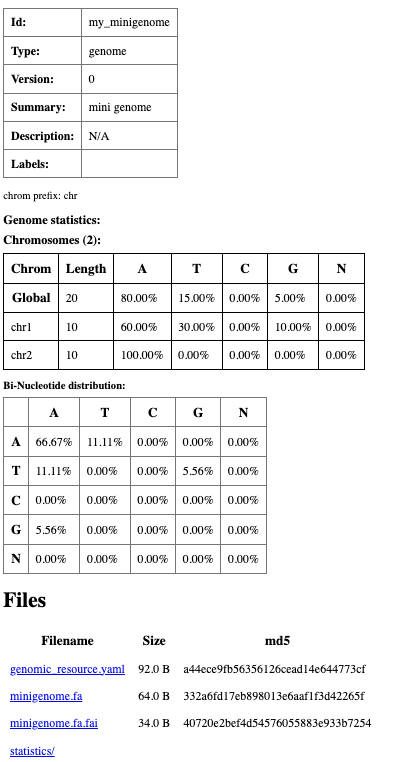

  Summary html page created for ``my_minigenome`` resource.

2: Genome (GRCh38.p14)
^^^^^^^^^^^^^^^^^^^^^^^
Next, we configure a real human genome resource. From inside ``my_GRR``, make a directory named ``my_genome`` and change 
into it:

.. code-block:: bash

    mkdir my_genome
    cd my_genome

Then fetch the ``GRCh38.p14`` genome FASTA from the GENCODE FTP site:

.. code-block:: bash

    curl -o GRCh38.p14.genome.fa.gz \
    https://ftp.ebi.ac.uk/pub/databases/gencode/Gencode_human/release_46/GRCh38.p14.genome.fa.gz

Use the following commands in the ``my_genome`` directory to unzip and index the FASTA file:

.. code-block:: bash

    gunzip GRCh38.p14.genome.fa.gz
    samtools faidx GRCh38.p14.genome.fa

Now that you have both the FASTA and its ``.fai`` index, add a ``genomic_resource.yaml`` file 
in this directory with the content below. Here, filename specifies the FASTA file used for the genome sequence, 
``chrom_prefix`` indicates that chromosome names in this assembly use the ``chr`` prefix, for example ``chr1``, and ``PARS`` 
lists the pseudoautosomal regions on chromosomes X and Y.

.. code-block:: yaml

    type: genome
    filename: GRCh38.p14.genome.fa
    chrom_prefix: "chr"

    PARS:
      "X":
        - "chrX:10000-2781479"
        - "chrX:155701382-156030895"
      "Y":
        - "chrY:10000-2781479"
        - "chrY:56887902-57217415"

    meta:
      summary: Nucleotide sequence of the GRCh38.p14 genome assembly

At this point, the ``my_genome`` resource can be used for annotation by GAIn. 
To validate it and obtain summary statistics, run ``grr_manage resource-repair`` in this directory. 
Be aware that this step can be slow (~5 minutes), as it processes the entire genome to build the report.

On successful completion, an ``index.html`` file will appear in the ``my_genome`` directory, 
which contains basic metadata about the resource, statistics such as chromosome length and nucleotide/dinucleotide 
composition, and a full inventory of the files that make up the resource. 

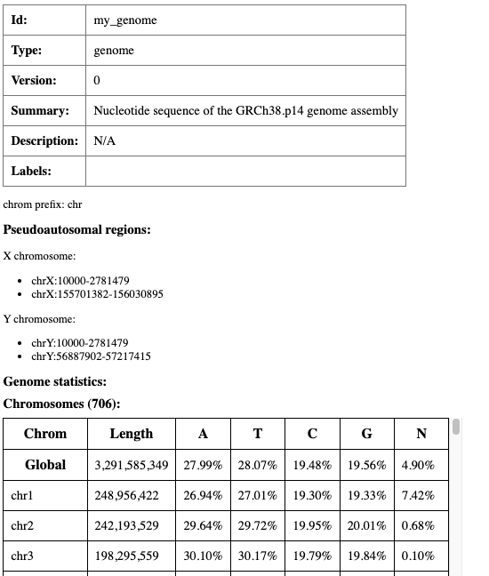

  Summary html page created for ``my_genome`` resource (partially displayed).

3: Gene models (MANE v1.4)
^^^^^^^^^^^^^^^^^^^^^^^
Next, we will create a gene model resource based on the MANE (Matched Annotation from NCBI and EBI) gene set, which offers a standardized transcript set for consistent use across genomic resources.
From inside ``my_GRR``, create a directory named ``my_genemodel`` and change into it:

.. code-block:: bash

    mkdir my_genemodel
    cd my_genemodel

First, we download the corresponding GTF file.

.. code-block:: bash

    curl -O https://ftp.ncbi.nlm.nih.gov/refseq/MANE/MANE_human/release_1.4/MANE.GRCh38.v1.4.ensembl_genomic.gtf.gz

Next, create a ``genomic_resource.yaml`` file in the ``my_genemodel`` directory with the following content:

.. code-block:: yaml

    type: gene_models

    filename: MANE.GRCh38.v1.4.ensembl_genomic.gtf.gz
    format: gtf

    meta:
      summary: MANE gene model version 1.4

With these files in place, ``my_genemodel`` is usable as a gene-model resource in GAIn. 
To check it and produce an HTML summary with basic statistics, execute ``grr_manage resource-repair`` in this directory.

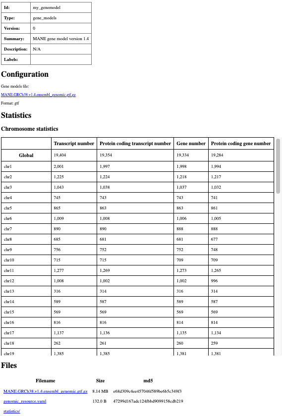

  Summary html page created for ``my_genemodel`` resource.

4: Toy position score
^^^^^^^^^^^^^^^^^^^^^^^
In this example, we will create a toy position score resource which only has scores for a few positions 
in chromosome 1. In your ``my_GRR`` directory, create a directory called ``my_miniposition``:

.. code-block:: bash

    mkdir my_miniposition
    cd my_miniposition

Run the following command to create a tab-separated file called ``mini_positionscore.tsv``. The file has three columns: the first column is the chromosome name, the second column is the 0-based position, and the third column is the score value.

.. code-block:: bash

    cat <<'EOF' | awk 'BEGIN{OFS="\t"} {print $1,$2,$3}' > mini_positionscore.tsv
    chr1        0       0
    chr1        1       0.1
    chr1        2       0.2
    chr1        3       0.3
    chr1        4       0.4
    EOF

Next, create a ``genomic_resource.yaml`` file in the ``my_miniposition`` directory with the following content:

.. code-block:: yaml

    type: position_score

    table:
      filename: mini_positionscore.tsv
      zero_based: True
      chrom:
        index: 0
      pos_begin:
        index: 1
      pos_end:
        index: 1

    scores:
    - id: pos_tsv_0
      type: float
      index: 2

    meta:
      summary: 0-based tsv position score

The resource is ready for use by GAIn. To check it and produce an HTML summary with basic statistics, 
execute ``grr_manage resource-repair`` in this directory.

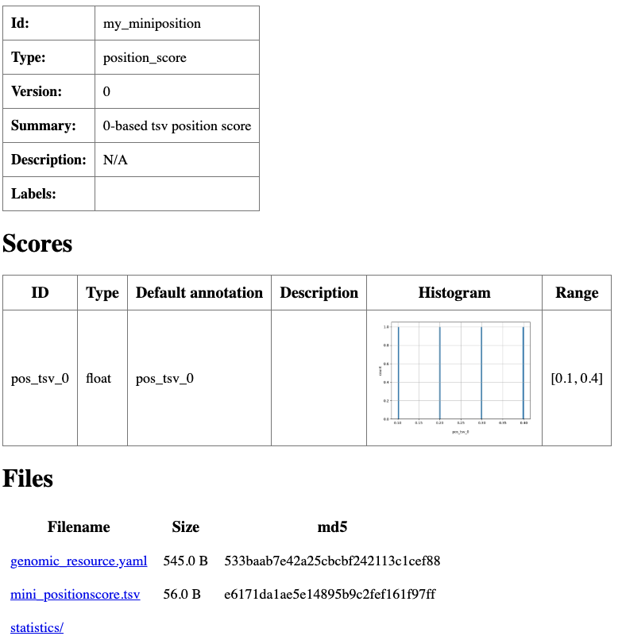

  Summary html page created for ``my_miniposition`` resource.

5: Position score (PhyloP7)
^^^^^^^^^^^^^^^^^^^^^^^

Let's now create a real position score resource. In your ``my_GRR`` directory, create a directory called ``my_position``:

.. code-block:: bash

    mkdir my_position
    cd my_position

phyloP (phylogenetic P-values) scores measure the evolutionary rate at individual nucleotides or other genomic elements. 
Let's download PhyloP7, which is derived from a multiple sequence alignment of the genomes of 7 different species 
(this is a large file around 5Gb, make sure you have enough space on your local drive).

.. code-block:: bash

    curl -O https://hgdownload.soe.ucsc.edu/goldenPath/hg38/phyloP7way/hg38.phyloP7way.bw

Next, create a ``genomic_resource.yaml`` file in the ``my_miniposition`` directory with the following content:

.. code-block:: yaml

    type: position_score

    table:
      filename: hg38.phyloP7way.bw
      header_mode: none
    
    scores:
    - id: phyloP7way
      type: float
      index: 3

    meta:
      summary: Conservation score based on the multiple alignment of 7 species

The resource is ready for use by GAIn. To check it and produce an HTML summary with basic statistics, 
execute ``grr_manage resource-repair`` in this directory (this will take around 30 minutes as GAIn processes the 
large file to create summary statistics).

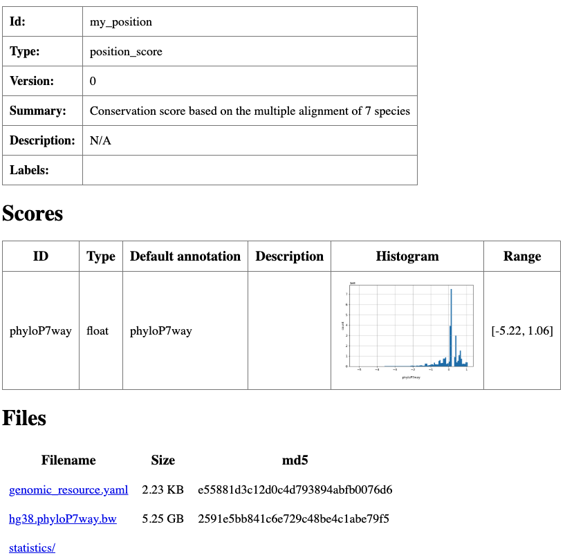

  Summary html page created for ``my_position`` resource.

6: Toy allele score
^^^^^^^^^^^^^^^^^^^^^^^

Next, let's create a toy allele score resource. In ``my_GRR``, create a new directory called ``my_miniallele`` and move into it:

.. code-block:: bash

    mkdir my_miniallele
    cd my_miniallele

Run the following command to create a tab-separated allele score file called ``mini_allelescore.tsv``. The file has six columns: chromosome name, 0-based position, reference allele, alternate allele, a numerical allele score, and an allele class represented by strings.

.. code-block:: bash

    cat <<'EOF' | awk 'BEGIN{OFS="\t"} {print $1,$2,$3,$4,$5,$6}' > mini_allelescore.tsv
    #chrom      pos     ref     alt     allele_score    allele_class
    chr1        0       T       A       1       good
    chr1        0       T       C       1.1     bad
    chr1        0       T       G       1.2     bad
    chr2        4       A       T       2       good
    chr2        4       A       C       2.1     bad
    chr2        4       A       G       2.2     bad
    EOF

To prepare this allele score file for fast random access in GAIn, first compress and index it with:

.. code-block:: bash

    bgzip mini_allelescore.tsv 
    tabix -s 1 -b 2 -e 2 -0 mini_allelescore.tsv.gz

Then create a ``genomic_resource.yaml`` file as shown. This file marks the resource as indexed, identifies which columns hold the chromosome, 
position, reference, and alternate alleles, and describes the score columns that GAIn can use during annotation.

.. code-block:: yaml

    type: allele_score

    table:
      filename: mini_allelescore.tsv.gz
      format: tabix
      zero_based: True

      chrom:
        name: chrom
      pos_begin:
        name: pos
      pos_end:
        name: pos
      reference:
        name: ref
      alternative:
        name: alt

    scores:
    - id: allele_score
      name: allele_score
      type: float
        
    - id: allele_class
      name: allele_class
      type: str

    meta:
      summary: A toy allele score resource with allele scores and allele classes.

The resource is ready for use by GAIn. To check it and produce an HTML summary with basic statistics, execute ``grr_manage resource-repair`` in this directory.

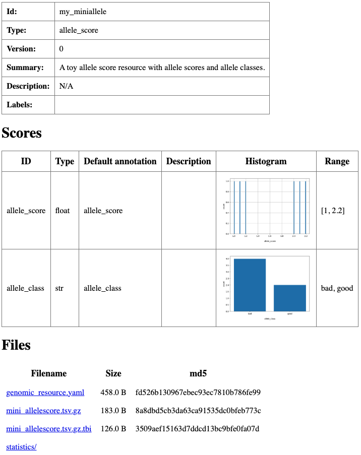

  Summary html page created for ``my_miniallele`` resource.

7: Allele score (AlphaMissense)
^^^^^^^^^^^^^^^^^^^^^^^
Next, let's create a real allele score resource. In your ``my_GRR`` directory, create a directory called ``my_allele``:

.. code-block:: bash

    mkdir my_allele
    cd my_allele

We will use AlphaMissense, a deep-learning-based missense variant deleteriousness score. Download the AlphaMissense score file for hg38 genome:

.. code-block:: bash

    curl -O https://zenodo.org/records/8208688/files/AlphaMissense_hg38.tsv.gz

A quick look at the downloaded file shows that the column names are listed on line four.

.. code-block:: bash

    gzip -dc AlphaMissense_hg38.tsv.gz | head

.. code-block:: text

    # Copyright 2023 DeepMind Technologies Limited
    #
    # Licensed under CC BY-NC-SA 4.0 license
    #CHROM	POS	REF	ALT	genome	uniprot_id	transcript_id	protein_variant	am_pathogenicity	am_class
    chr1	69094	G	T	hg38	Q8NH21	ENST00000335137.4	V2L	0.2937	likely_benign
    chr1	69094	G	C	hg38	Q8NH21	ENST00000335137.4	V2L	0.2937	likely_benign
    chr1	69094	G	A	hg38	Q8NH21	ENST00000335137.4	V2M	0.3296	likely_benign
    chr1	69095	T	C	hg38	Q8NH21	ENST00000335137.4	V2A	0.2609	likely_benign
    chr1	69095	T	A	hg38	Q8NH21	ENST00000335137.4	V2E	0.2922	likely_benign
    chr1	69095	T	G	hg38	Q8NH21	ENST00000335137.4	V2G	0.203	likely_benign

GAIn expects the column headers on the first line. Accordingly, we decompress the file, strip the first three lines, 
write the processed content to a new file, and delete the original file to minimize disk usage.

.. code-block:: bash

    gzip -dc AlphaMissense_hg38.tsv.gz \
    | sed '1,3d' \
    | bgzip > AlphaMissense_hg38_modified.tsv.gz
    rm AlphaMissense_hg38.tsv.gz

A second look at the resource file confirms that the column names are on line 1.

.. code-block:: bash
    bgzip -dc AlphaMissense_hg38_modified.tsv.gz | head -5

.. code-block:: text

    #CHROM	POS	REF	ALT	genome	uniprot_id	transcript_id	protein_variant	am_pathogenicity	am_class
    chr1	69094	G	T	hg38	Q8NH21	ENST00000335137.4	V2L	0.2937	likely_benign
    chr1	69094	G	C	hg38	Q8NH21	ENST00000335137.4	V2L	0.2937	likely_benign
    chr1	69094	G	A	hg38	Q8NH21	ENST00000335137.4	V2M	0.3296	likely_benign
    chr1	69095	T	C	hg38	Q8NH21	ENST00000335137.4	V2A	0.2609	likely_benign

The resource is now ready to be included in a GRR. As is typical for allele resources, the ``chrom`` and ``pos`` columns 
specify the genomic coordinates of the variant, while REF and ALT describe the variant itself. 
AlphaMissense also provides genome, UniProt, and transcript identifiers, as well as the amino acid substitution caused 
by the missense mutation (for example, the first variant changes valine to leucine). The last two columns report the 
scoring results: ``am_pathogenicity`` provides the predicted effect of the variant on protein structure and function, 
and ``am_class`` converts this score into categorical labels, with values below 0.34 classified as ``likely_benign`` and values above 0.564 as ``likely_pathogenic``.

To index the resource by genomic coordinates, we run the following command:

.. code-block:: bash

    tabix -s 1 -b 2 -e 2 AlphaMissense_hg38_modified.tsv.gz

Next, we create a text file called ``genomic_resource.yaml`` so that the resource is recognized 
by GAIn. As a first step, we configure it to ingest only the ``am_pathogenicity`` scores from 
the source file. In this ``YAML`` file, rather than using column indices, we explicitly specify 
the column names corresponding to chromosome, position, reference, and alternative alleles. 
We also customize the histogram generated by GAIn by setting the score range to 0-1 
(the AlphaMissense score range), using 100 bins, and applying a logarithmic scale to the ``y-axis``. 
Finally, we define the interpretation of low and high scores, which will be displayed 
on the summary page.

.. code-block:: yaml

    type: allele_score
    allele_score_mode: substitutions

    table:
      filename: AlphaMissense_hg38_modified.tsv.gz
      format: tabix

      chrom:
        name: CHROM
      pos_begin:
        name: POS
      pos_end:
        name: POS
      reference:
        name: REF
      alternative:
        name: ALT

    scores:
    - id: am_pathogenicity
      name: am_pathogenicity
      type: float
      desc: |
        AlphaMissense Pathogenicity score is a deleteriousness score for missense variants
      large_values_desc: "more pathogenic"
      small_values_desc: "less pathogenic"
      histogram:
        type: number
        number_of_bins: 100
        view_range:
          min: 0.0
          max: 1.0
        y_log_scale: True
      
    meta:
      summary: Functional impact of mutations on protein function

At this point, GAIn can use the resource for annotation. 
Running ``grr_manage resource-repair`` produces the following summary page, 
which currently includes only the ``am_pathogenicity`` score.

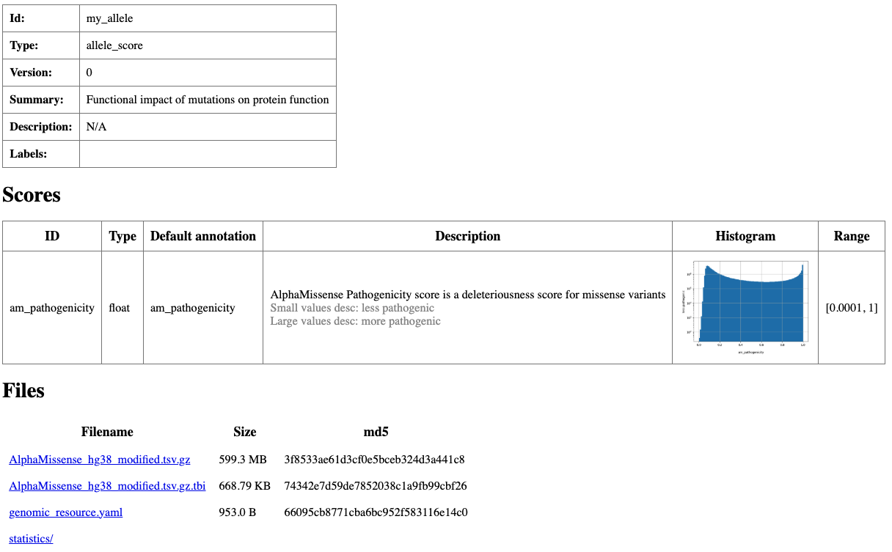

  Summary html page created for ``my_allele`` resource.

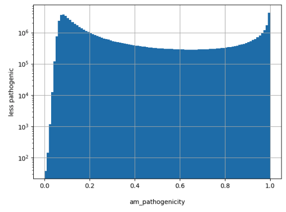

  Histogram created for ``am_pathogenicity`` scores.

To include the ``am_class`` scores, add the following entries to the scores section, 
configuring the histogram as categorical and enabling a log scale on the ``y-axis``.

.. code-block:: yaml

  - id: am_class
    name: am_class
    type: str
    desc: |
      AlphaMissense Class is a deleteriousness category for missense variants
    histogram:
      type: categorical
      y_log_scale: True

Running ``grr_manage resource-repair`` with the updated ``genomic_resource.yaml`` 
file produces the updated resource page shown below, now displaying both the 
``am_pathogenicity`` and ``am_class`` scores.

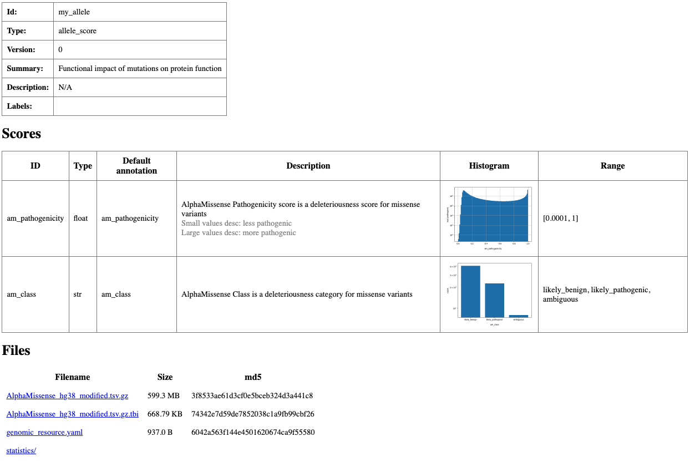

  Updated summary HTML page created for ``my_allele`` resource.

8: Toy gene score
^^^^^^^^^^^^^^^^^^^^^^^

Create a new folder for the resource and move into it:

.. code-block:: bash

    mkdir my_minigenescore
    cd my_minigenescore

Create a comma-separated file called ``my_minigenescore.csv`` with the following content:

.. code-block:: bash

    gene,my_minigenescore
    CHD8,9
    TP53,3
    CFTR,7

This resource provides a single score for three example genes. 
Next, create a ``genomic_resource.yaml`` file in the same directory with this content:

.. code-block:: yaml

    type: gene_score
    filename: my_minigenescore.csv

    scores:
    - id: my_minigenescore
      histogram:
        type: number

    meta:
      summary: A custom gene score
      description: This is a custom gene score for demonstration purposes.

Finally, while still in the ``my_minigenescore`` directory, run:

.. code-block:: bash

    grr_manage resource-repair

This command checks that the resource is usable for annotation and produces an HTML 
summary file with basic descriptions and histograms for the ``my_minigenescore`` values.

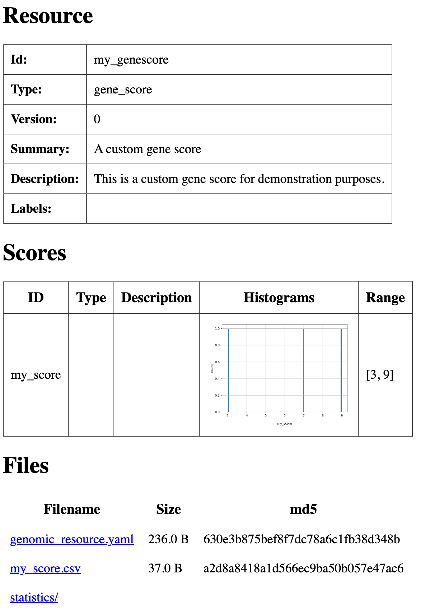

  Summary html page created for ``my_minigenescore`` resource.

9: Gene score (pLI)
^^^^^^^^^^^^^^^^^^^^^^^

As a real-world example of a gene score, we use pLI (probability of loss-of-function intolerance), which reflects a gene's sensitivity 
to loss-of-function mutations, with higher values indicating greater intolerance. The pLI score was introduced by `Lek et al.` in 2016.

Create a new folder for the resource and move into it:

.. code-block:: bash

    mkdir my_genescore
    cd my_genescore

At https://www.nature.com/articles/nature19057#Sec16, download the ZIP file containing the Supplementary Tables and unzip it. We focus on Supplementary Table 13, specifically the “Gene Constraint” sheet, which reports pLI scores and related constraint metrics for human genes. Run the following command to create a CSV file called pLI.csv. The file has two columns: the gene name and the corresponding pLI score. Before running the command, install ``openpyxl`` with ``mamba install openpyxl`` if it is not already installed.

.. code-block:: bash

    python - <<'PY'
    import pandas as pd

    df = pd.read_excel(
        "nature19057-SI Table 13.xlsx",
        sheet_name="Gene Constraint",
        engine="openpyxl",
    )

    out = df[["gene", "pLI"]].copy()
    out.to_csv("pLI.csv", index=False)
    PY

The first few lines of pLI.csv will look like this:

.. code-block:: text

    gene,pLI
    AGRN,0.17335234
    NOC2L,1.33E-19
    B3GALT6,0.048104466
    C1orf159,0.090877636
    ISG15,0.009847813
    KLHL17,2.52E-07
    PLEKHN1,2.02E-08

Next, create a ``genomic_resource.yaml`` file in the same directory with this content:

.. code-block:: yaml

    type: gene_score
    filename: pLI.csv
    scores:
    - id: pLI
      desc: Probability of Loss-of-Function Intolerance
      small_values_desc: "less likely to be Loss-of-function intolerant"
      large_values_desc: "more likely to be Loss-of-function intolerant"
      histogram:
        type: number
        number_of_bins: 100
        view_range:
            min: 0
            max: 1
        x_min_log: 0.00001
        x_log_scale: false
        y_log_scale: true
    
    meta:
      summary: Probability of Loss-of-Function Intolerance
      description: The probability of loss-of-function intolerance (pLI) score reflects a gene's sensitivity to LoF mutations.

Finally, while still in the ``my_genescore`` directory, run:

.. code-block:: bash

    grr_manage resource-repair

This command checks that the resource is usable for annotation and produces an HTML 
summary file with basic descriptions and histograms for the ``my_genescore`` values.

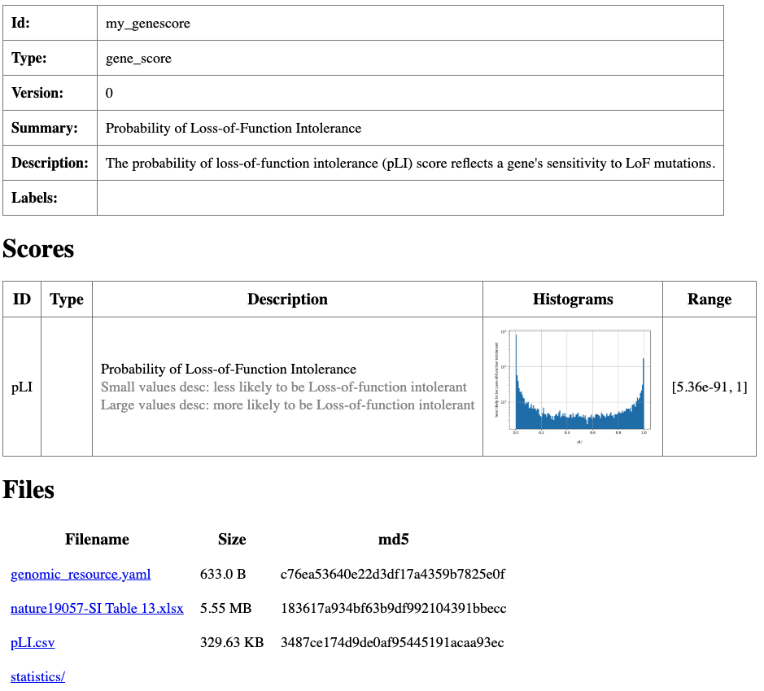

  Summary html page created for ``my_genescore`` resource.

10: Toy gene sets
^^^^^^^^^^^^^^^^^^^^^^^^

Gene set resources group biologically related genes and support membership and enrichment analyses. In GAIn, gene sets use a custom text representation. 
To illustrate how gene set resources are defined and used, we will create a toy gene set as a concrete example.

Create a new folder for the resource and move into it:

.. code-block:: bash

    mkdir my_minigenesets
    cd my_minigenesets

First, create another text file named ``map.txt`` with the following content. 
This file defines gene-to-set memberships: the left column lists gene names, and the right column lists the set identifier(s) for each gene. 
In this example, CHD8 and CFTR belong only to set 1, while TP53 belongs to sets 2 and 3.

.. code-block:: text

    CHD8	set_1
    TP53	set_2 set_3
    CFTR	set_3

Finally, make a ``genomic_resource.yaml`` file with the following content. 

.. code-block:: yaml

    type: gene_set_collection
    id: genesets
    format: map
    filename: map.txt

    meta:
      summary: mini gene sets collection

Finally, while still in the ``my_minigenesets`` directory, run:

.. code-block:: bash

    grr_manage resource-repair

This command checks that the resource is usable for annotation and produces 
an HTML summary file with basic descriptions and histograms for the ``my_minigenesets`` resource.

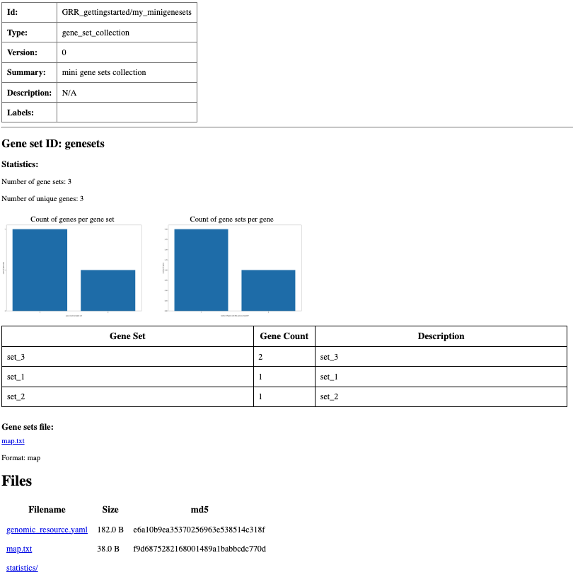

  Summary html page created for ``my_minigenesets`` resource.

11: Gene sets (MSigDB)
^^^^^^^^^^^^^^^^^^^^^^^^

As a real-world example of a gene set resource, we will create a MSigDB (Molecular Signatures Database) gene sets derived from a variety of curated sources. The Curated (C2) collection in MSigDB includes gene sets from canonical pathway databases (e.g., KEGG, Reactome, BioCarta) and from published gene expression studies, capturing well-defined pathways and perturbation signatures.

To create a gene sets resource for MSigDB, make a new folder for the resource and move into it:

.. code-block:: bash

    mkdir my_genesets
    cd my_genesets

Grab MSigDB gene sets in GMT format from the Broad Institute website:

.. code-block:: bash

    curl -O https://data.broadinstitute.org/gsea-msigdb/msigdb/release/7.4/c2.all.v7.4.symbols.gmt

Prepare a ``genomic_resource.yaml`` with the following content to make the resource available in GAIn:

.. code-block:: yaml

    type: gene_set_collection
    id: MSigDB_curated
    format: gmt
    filename: c2.all.v7.4.symbols.gmt
    histograms:
    genes_per_gene_set:
      type: number
      y_log_scale: True
    gene_sets_per_gene:
      type: number
      y_log_scale: True
    meta:
      summary: MSigDB (Molecular Signatures Database) gene sets

Finally, from inside the ``my_genesets`` directory, run:

.. code-block:: bash

    grr_manage resource-repair

This validates the resource for annotation and generates an HTML summary page with basic descriptions and histograms for ``my_genesets``.

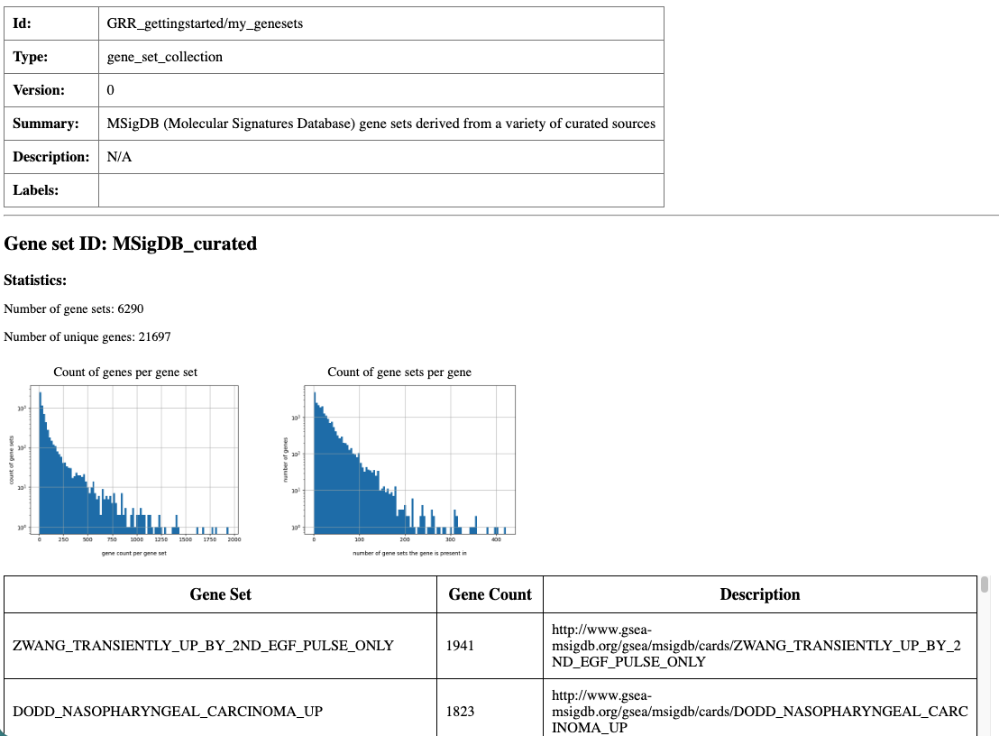

  Partial screen shot of the summary html page created for ``my_genesets`` resource.

12: Toy CNV collection
^^^^^^^^^^^^^^^^^^^^^^

Copy-number variants (CNVs) are deletions or duplications of genomic segments. 
In practice, CNV resources summarize previously observed gains and losses so you can contextualize a query locus by 
interval overlap. In GAIn, CNV collections are represented as tabular files plus a small YAML definition that 
declares which columns should be exposed as annotation attributes.

Create a new folder for the resource and move into it:

.. code-block:: bash

    mkdir my_miniCNVcollection
    cd my_miniCNVcollection

Run the following command to create a tab-separated CNV collection file called my_miniCNVcollection.txt. The file has six columns: chromosome name, start position, end position, CNV name, deletion/duplication class, and frequency.

.. code-block:: bash

    cat <<'EOF' | awk 'BEGIN{OFS="\t"} {print $1,$2,$3,$4,$5,$6}' > my_miniCNVcollection.txt
    chrom   pos_beg pos_end CNV_name          deletion_duplication frequency
    chr1    3       15      Chr1_duplication  Duplication           0.1
    chr2    5       15      Chr2_duplication  Deletion              0.2
    EOF

This file defines two example CNVs. Each row specifies an interval (``chrom``, ``pos_beg``, ``pos_end``), a CNV identifier (``CNV_name``), the CNV type (``deletion_duplication``) and ``frequency``.

Next, create a ``genomic_resource.yaml`` file in the same directory with this content:

.. code-block:: yaml

    type: cnv_collection
    table:
      filename: my_miniCNVcollection.txt

    scores:
    - id: CNV type
      name: deletion_duplication
      type: str
      desc: duplication or deletion
    - id: CNV frequency
      name: frequency
      type: float
      desc: CNV frequency

    meta:
      summary: CNV collection resource

In this resource, the interval columns (``chrom``, ``pos_beg``, ``pos_end``) are stored in the table and used for overlap queries, 
while the two fields listed under scores (CNV type and CNV frequency) are exposed as attributes that can be emitted in annotation output.

Finally, while still in the ``my_miniCNVcollection`` directory, run:

.. code-block:: bash

    grr_manage resource-repair

This command checks that the resource is usable for annotation and produces an HTML summary file with basic descriptions for the CNV collection resource.

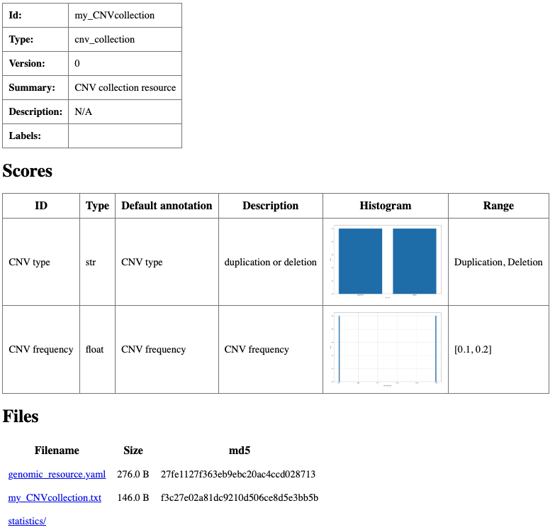

    Summary html page created for ``my_miniCNVcollection`` resource.

13: CNV collection (Iossifov 2021)
^^^^^^^^^^^^^^^^^^^^^^^^^^^^^^^^^^
As a real-world example, we will build a CNV collection resource from Supplementary Data 4 of `Yoon et al.` (2021), which lists the `de novo` CNVs 
included in their analysis from WGS of SSC (simplex) and AGRE (multiplex) families.

Create a new folder for the resource and move into it:

.. code-block:: bash

    mkdir my_CNVcollection
    cd my_CNVcollection

First download the resource file:

.. code-block:: bash

    curl -O https://static-content.springer.com/esm/art%3A10.1038%2Fs42003-021-02533-z/MediaObjects/42003_2021_2533_MOESM6_ESM.xlsx

This command downloads an Excel workbook with two sheets. In this example, we use the "De novo CNV in SSC and AGRE" sheet, which contains the de novo CNV intervals and associated metadata.

.. csv-table::
    :header-rows: 1

    UCSCLink,collection,familyId,in affected status,personIds,location,variant,size,publicaton,genomic region,number of genes,genes
    LINK,SSC,12613,affected,12613.p1,chr1:1305145-1314126,duplication,8982,,coding,3,"ACAP3,INTS11,PUSL1"
    LINK,AGRE,AU2725202_AU2725201,affected,AU2725301,chr1:3069177-4783791,duplication,1714615,,coding,13,"AJAP1,ARHGEF16,C1orf174,CCDC27,CEP104,DFFB,LRRC47,MEGF6,PRDM16,SMIM1,TP73,TPRG1L,WRAP73"
    LINK,SSC,13424,unaffected,13424.s1,chr1:3975501-3977800,deletion,2300,,intergenic,0,
    LINK,SSC,12852,affected,12852.p1,chr1:6647401-6650500,deletion,3100,,inter-coding_intronic,1,DNAJC11
    LINK,SSC,13776,affected,13776.p1,chr1:8652301-8657600,deletion,5300,,coding,1,RERE
    LINK,SSC,13373,unaffected,13373.s1,chr1:9992001-9994100,deletion,2100,,intergenic,0,

The downloaded table does not include explicit ``chrom``, ``pos_beg``, or ``pos_end`` columns. 
Instead, these coordinates are encoded in the location field (for example, ``chr1:1305145-1314126``). 
Run the script below in your terminal to split location into ``chrom``, ``pos_beg``, and ``pos_end``, 
retain the ``variant`` and ``size`` columns, and write the result to a tab-separated file 
named ``Iossifov_Lab_SSC_AGRE_2021.tsv`` (before running the script, install ``openpyxl`` by ``mamba install openpyxl``).

.. code-block:: bash

    python - <<'PY'
    import pandas as pd

    df = pd.read_csv("download-csv.php", sep=",", dtype=str)
    df["chrom"] = "chr" + df["cnv-locus"].str.extract(r"^(\d+|X|Y|M|MT)(?=[pq])")[0]
    df[["pos_beg","pos_end"]] = df["basepair-range"].str.extract(r"(\d+)-(\d+)").astype(int)
    out = pd.DataFrame({
        "chrom": df["chrom"],
        "pos_beg": df["pos_beg"],
        "pos_end": df["pos_end"],
        "CNV_name": df["cnv-locus"] + " " + df["cnv-type"],
        "deletion_duplication": df["cnv-type"],
    })
    out.to_csv("Iossifov_Lab_SSC_AGRE_2021.tsv", sep="\t", index=False)
    PY

After running the script, inspect ``Iossifov_Lab_SSC_AGRE_2021.tsv`` to confirm the coordinate columns (``chrom``, ``pos_begin``, and ``pos_end``) 
and attribute columns.

.. csv-table::
    :header-rows: 1

    chrom,pos_beg,pos_end,variant,size
    chr1,1305145,1314126,duplication,8982
    chr1,3069177,4783791,duplication,1714615
    chr1,3975501,3977800,deletion,2300
    chr1,6647401,6650500,deletion,3100
    chr1,8652301,8657600,deletion,5300
    chr1,9992001,9994100,deletion,2100

Prepare a ``genomic_resource.yaml`` with the following content to make the resource available in GAIn:

.. code-block:: yaml

    type: cnv_collection
    table:
      filename: Iossifov_Lab_SSC_AGRE_2021.tsv

    scores:
    - id: CNV_type 
      name: variant
      type: str
      desc: CNV type
    - id: CNV_size 
      name: size
      type: int
      desc: CNV size
      histogram:
        type: number
        y_log_scale: True
        
    meta:
      summary: Iossifov Lab SSC AGRE 2021 CNV collection

Finally, while still in the resource directory, run:

.. code-block:: bash

    grr_manage resource-repair

This command validates the CNV collection resource for use in annotation and generates an HTML summary page with basic descriptions 
and any available statistics for the CNV collection resource.

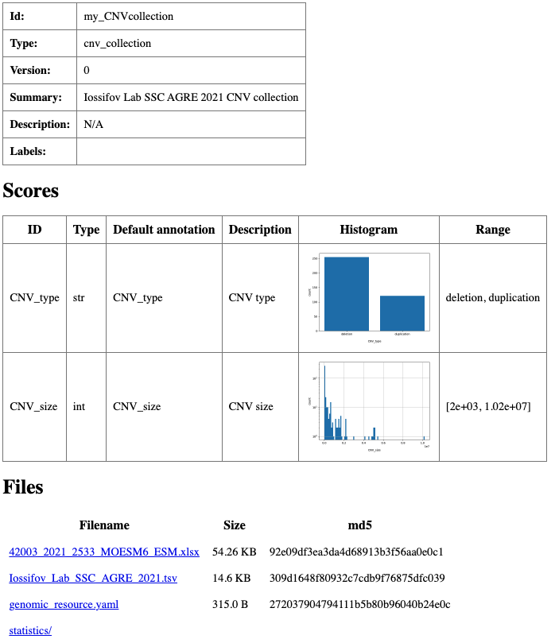

    Summary html page created for ``my_CNVcollection`` resource.

Browse the local GRR
--------------------

After creating the resources above, the local GRR contains 13 resources covering several GRR resource types, including genomes, gene models, position scores, allele scores, gene scores, gene sets, and CNV collections. The main local GRR directory (``my_GRR``) includes an HTML summary page, ``index.html``, that provides a convenient way to browse the repository. This page lists the resources in a searchable table, including their type, ID, version, total size, and summary.

This summary page is a useful checkpoint before running annotation. The resource IDs shown in the table are the same IDs used in annotation pipeline files, such as ``my_genome``, ``my_genemodel``, ``my_position``, ``my_allele``, and ``my_genescore``.

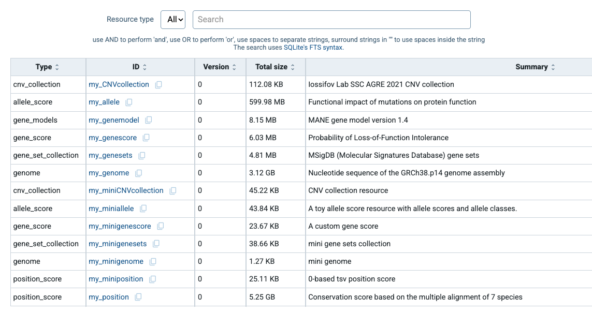
    
    Repository-level summary page for ``my_GRR``. The table lists the local resources and allows searching by resource type, resource ID, or summary.

Annotate using the local GRR
------------------------------

Your local GRR is now ready to support annotation. The examples above added several local resources, including genomes, gene models, position scores, and allele scores. Since ``my_GRR`` is listed in ``~/.grr_definition.yaml``, GAIn can use these resources during annotation. The example below uses the local resources created in this guide.

Create a file named ``annotation_pipeline_local.yaml`` with the following content:

.. code-block:: yaml

    preamble:
      summary: Local pipeline
      input_reference_genome: my_genome

    annotators:
    - effect_annotator:
        gene_models: my_genemodel
        attributes:
        - worst_effect
        - gene_list
        - genes

    - position_score_annotator:
        resource_id: my_position

    - normalize_allele_annotator

    - allele_score_annotator:
        resource_id: my_allele
        input_annotatable: normalized_allele

    - gene_score_annotator:
        resource_id: my_genescore
        input_gene_list: gene_list

Run the following command to annotate your variants using this pipeline:

.. code-block:: bash

    annotate_tabular small_input.csv annotation_pipeline_local.yaml -o variants_local_annotated.csv

This command creates a file named ``variants_local_annotated.csv`` with the following content:

.. csv-table::
    :header-rows: 1

    chrom,pos,ref,alt,worst_effect,genes,phyloP7way,am_pathogenicity,am_class,pLI
    chr14,21415880,G,A,nonsense,CHD8,0.917,,,CHD8:1
    chr17,7674904,TCT,T,frame-shift,TP53,-0.12,,,TP53:0.912
    chr7,117587806,G,A,missense,CFTR,0.917,0.99,likely_pathogenic,CFTR:2.96e-36

mini-GRR: a template GRR
-----------------------

Defining new genomic resources can feel abstract at first: different resource types expect different file formats, coordinate conventions, and configuration options in ``genomic_resource.yaml``. To make these patterns easier to inspect, we provide ``mini-GRR``, a small, self-contained Genomic Resource Repository that can be used as a template or reference.

You can clone ``mini-GRR`` with:

.. code-block:: bash

    git clone git@github.com:iossifovlab/mini-GRR.git
    cd mini-GRR

``mini-GRR`` contains a toy genome with ready-made ``genomic_resource.yaml`` descriptors, plus minimal examples of gene models, position scores, allele scores, gene scores, and gene sets. The resources span common file types, such as TSV/tabix, BedGraph/BigWig, and VCF, and include both 0-based and 1-based coordinate conventions.

To use ``mini-GRR`` with GAIn, add it to your ``~/.grr_definition.yaml`` file in the same way as any other local GRR:

.. code-block:: yaml

    id: development
    type: group
    children:
    - id: mini-GRR
      type: directory
      directory: <path_to_mini_grr>/mini-GRR

Once configured, you can browse and run pipelines against ``mini-GRR`` to verify that your GAIn installation and GRR configuration work as expected. After you understand how a resource is structured, you can use the corresponding ``mini-GRR`` example as a starting point for your own data by replacing the toy files and editing ``genomic_resource.yaml``. In this way, ``mini-GRR`` provides a compact reference for GRR directory layout, metadata fields, and resource configuration.