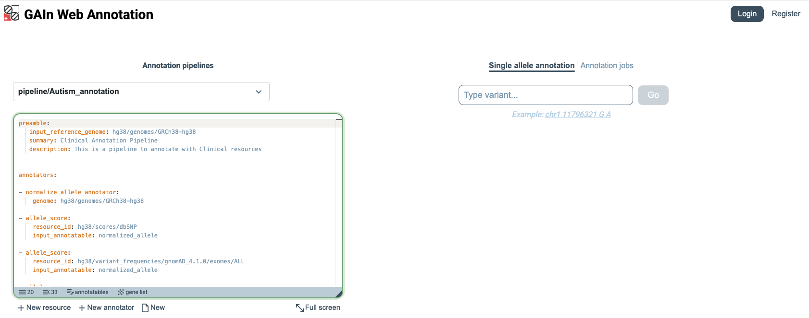
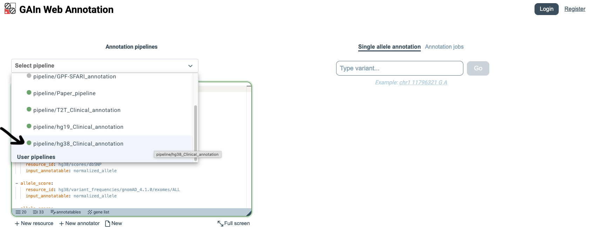
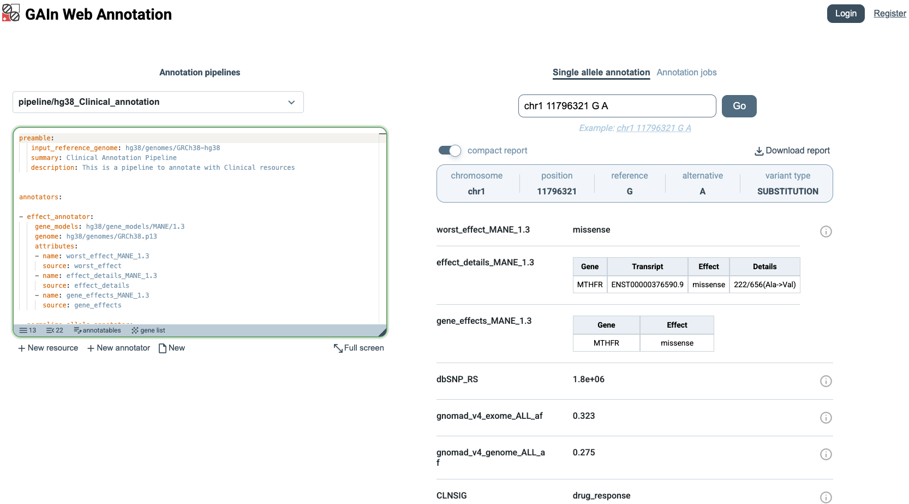
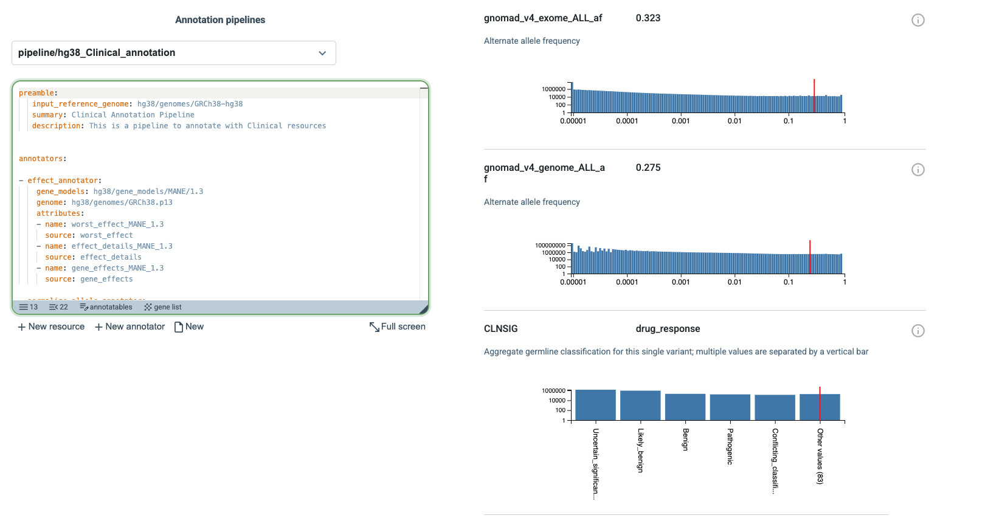

Getting started on the web
===============================

The GAIn Web Annotation page (https://gain.iossifovlab.com/) 
provides a simple and interactive interface for annotating genetic variants, positions, or regions, collectively referred to as annotatables, on 
the web. The page is organized into two main areas. On the left, users can create, edit, and manage 
annotation pipelines, either by selecting a saved pipeline or by building a new one. This pipeline editor 
defines which resources and annotators are applied during annotation. On the right, users can 
enter an annotatable, submit it for processing, and view the resulting annotations in 
the same area. Together, these two panels allow users to configure an annotation workflow and 
immediately apply it to annotatables of interest.

Select annotation pipeline
****************

To begin, open the Select pipeline menu, scroll through the available options, and choose 
``pipeline/hg38_Clinical_annotation``. This pipeline is designed for annotatables provided in the ``hg38`` 
assembly and annotates them with a broad set of clinically relevant attributes. In addition to effect prediction, 
it incorporates information from resources such as dbSNP, gnomAD, 
ClinVar, CADD, AlphaMissense, MPC, and gene-level constraint scores. After selecting it, users can review 
the full annotation pipeline definition in the box on the left.

Single annotatable
****************

The GAIn web interface has two annotation modes: **Single annotatable**, for interactively annotating one variant, 
position, or region at a time, and **Annotation jobs**, for annotating files containing multiple annotatables. 
We begin with the Single annotatable mode. 
Next, either enter your own annotatable in ``hg38`` coordinates, or click the ``i`` button left of the entry field and 
choose an example annotatable. 
Example annotatables cover a wide range of syntax options for entering genomic positions, regions, or variants. 
This automatically enters the example annotatable, runs the selected pipeline on it, and displays the resulting 
annotations on the right side of the page. In this example, we choose a variant annotatable, 
which is defined by chromosome, position, reference allele, and alternative allele.

The annotation results can be viewed in two formats. In the **compact report** view, 
only the annotation results are shown, making it easier to scan the output. This view is useful when a 
concise summary is needed without additional details.

When **compact report** is turned off, the page shows a more detailed view of the results. 
In this view, annotations that include score distributions are accompanied by plots showing 
how the scores are distributed across the resource and where the queried annotatable falls within that distribution. 
In the example shown here, three such distributions are displayed. The red line marks the score of the queried 
annotatable, making it easy to see its position relative to the overall distribution.

Annotation jobs
*****************

The second annotation mode is **Annotation jobs**, which allows multiple annotatables 
to be annotated at once. In this mode, users upload a file in tabular or VCF format 
containing annotatables (variants, positions, or regions) with the required coordinate 
information. Click Annotation jobs on the right side of the page. 

.. figure:: figures/GAInWeb5.png

The example below uses variant annotatables. 
Prepare a tab-delimited file named ``variants.txt`` with the following content:

.. csv-table::
    :header-rows: 1

    chrom,pos,ref,alt
    chr11,5227002,T,A
    chr12,102840493,G,A

After creating this file, drag and drop it into the upload area, or click Choose file and select ``variants.txt`` for annotation.

When the file is uploaded, GAIn automatically recognizes the ``chrom``, ``pos``, ``ref``, and ``alt`` columns because the file uses those exact column names. If the input file uses different column labels, users can manually specify which columns correspond to ``chrom``, ``pos``, ``ref``, and ``alt`` before creating the annotation job.

.. figure:: figures/GAInWeb6.png

Once the annotation job has finished, GAIn shows its status as ``success``. 
Users can then click the Download button next to the result to download a file containing 
the annotation attributes produced for all annotatables in the input file. 

.. figure:: figures/GAInWeb7.png

The downloaded file includes the original variant columns together with the annotations generated by 
the selected pipeline, 
such as effect predictions, population frequencies, clinical classifications, pathogenicity scores, 
and gene-level scores. The downloaded output for ``variants.txt`` is shown below.

.. csv-table::
    :header-rows: 1

    chrom,pos,ref,alt,worst_effect_MANE_1.3,effect_details_MANE_1.3,gene_effects_MANE_1.3,dbSNP_RS,gnomad_v4_exome_ALL_af,gnomad_v4_genome_ALL_af,CLNSIG,CLNDN,cadd_raw,cadd_phred,am_pathogenicity,mpc,worst_effect,gene_effects,effect_details,pLI_rank_all,pLI_rank_min,LOEUF_rank_all,LOEUF_rank_min
    chr11,5227002,T,A,missense,ENST00000335295.4:HBB:missense:7/147(Glu->Val),HBB:missense,334,0.0016,0.0127,Pathogenic,HBB-related_disorder|Beta-thalassemia_HBB/LCRB|Fetal_hemoglobin_quantitative_trait_locus_1|Erythrocytosis|_familial|_6|METHEMOGLOBINEMIA|_BETA_TYPE|beta_Thalassemia|Hb_SS_disease|Heinz_body_anemia|Malaria|_susceptibility_to|alpha_Thalassemia|Dominant_beta-thalassemia|Anemia|See_cases|Sickle_cell-hemoglobin_C_disease|Sickle_cell_disease_and_related_diseases|Malaria|_resistance_to|not_provided|Inborn_genetic_diseases|HEMOGLOBIN_S,1.89,18.9,0.223,0.0374,missense,HBB:missense|ENSG00000298932:non-coding-intron,ENST00000335295.4:HBB:missense:7/147(Glu->Val)|ENST00000485743.1:HBB:missense:7/111(Glu->Val)|ENST00000647020.1:HBB:missense:7/147(Glu->Val)|ENST00000759072.1:ENSG00000298932:non-coding-intron:None/None[None],"{'HBB': 16189.0}",1.62e+04,"{'HBB': 19184.0}",1.92e+04
    chr12,102840493,G,A,missense,ENST00000553106.6:PAH:missense:408/452(Arg->Trp),PAH:missense,5030858,0.00137,0.000861,Pathogenic,PAH-related_disorder|See_cases|Phenylketonuria|Inborn_genetic_diseases|not_provided,4.22,27.9,0.918,0.245,missense,PAH:missense,ENST00000307000.7:PAH:missense:403/447(Arg->Trp)|ENST00000553106.6:PAH:missense:408/452(Arg->Trp),"{'PAH': 16912.0}",1.69e+04,"{'PAH': 15520.0}",1.55e+04

This concludes the Getting Started on the Web section, which demonstrated how to use a saved annotation pipeline in both the Single annotatable and Annotation jobs modes.

The `GAIn web Interface <https://iossifovlab.com/gaindocs/web_interface.html>`_ section below will describe the 
web interface in more detail, 
including custom annotation pipelines, registration, and additional features of the site.