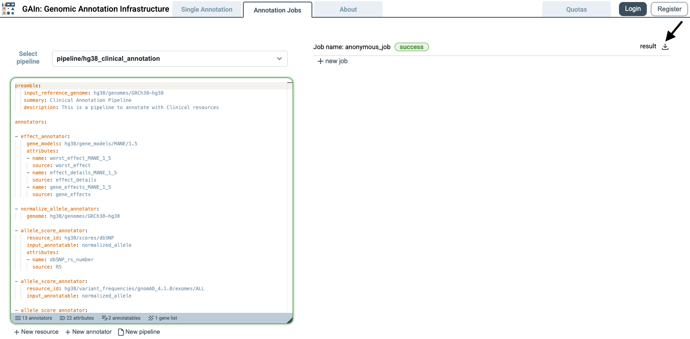

Getting started on the web
===============================

The GAIn Web Annotation page (https://gain.iossifovlab.com/) 
provides a simple and interactive interface for annotating genetic variants, positions, or regions, collectively referred to as annotatables. The page is organized into two main areas. On the left, users can create, edit, and manage annotation pipelines, either by selecting a saved pipeline or by building a new one. This pipeline editor defines which resources and annotators are applied during annotation. On the right, users can enter an annotatable, submit it for processing, and view the resulting annotations. Together, these two panels allow users to configure an annotation workflow and immediately apply it to annotatables of interest.

.. figure:: figures/GAInWeb1b.png

Select annotation pipeline
**************************

To begin, open the Select pipeline menu, scroll through the available options, and choose ``pipeline/hg38_clinical_annotation``. This pipeline is designed for annotatables provided in the ``hg38`` assembly and annotates them with a broad set of clinically relevant attributes. In addition to effect prediction, it incorporates information from resources such as dbSNP, gnomAD, ClinVar, CADD, AlphaMissense, MPC, and gene-level constraint scores. After selecting it, users can review the full annotation pipeline definition in the annotation pipeline editor on the left.

.. figure:: figures/GAInWeb2b.png
  :scale: 50 %

Single annotation
*****************

The GAIn web interface has two annotation modes: **Single annotation**, for interactively annotating one variant, position, or region at a time, and **Annotation jobs**, for annotating files containing multiple annotatables. This section demonstrates the use of Single annotation mode. Users can either enter their own annotatable in ``hg38`` coordinates, or click the ``i`` button to the left of the entry field and choose an example annotatable. Example annotatables cover a wide range of syntax options for entering genomic positions, regions, or variants. This automatically enters the example annotatable, runs the selected pipeline on it, and displays the resulting annotations on the right side of the page. In this example, we choose a variant annotatable, which is defined by chromosome, position, reference allele, and alternative allele.

The annotation results on the right panel can be viewed in two formats. In the **compact report** view, when full report is turned off, only the annotation results are shown, making it easier to scan the output. This view is useful when a concise summary is needed without additional details.

.. figure:: figures/GAInWeb3b.png
  :scale: 50 %

When **full report** is turned on, the page shows a more detailed view of the results. In this view, annotations that include score distributions are accompanied by plots showing how the scores are distributed across the resource and where the queried annotatable falls within that distribution. In the example shown here, two such distributions are displayed, with a red line marking where the queried annotatable falls in relation to the overall distribution.

.. figure:: figures/GAInWeb4b.png
  :scale: 50 %

Annotation jobs
***************

The second annotation mode is **Annotation jobs**, which allows multiple annotatables 
to be annotated at once. In this mode, users upload a file in tabular or VCF format 
containing annotatables (variants, positions, or regions) with the required coordinate 
information. Click Annotation jobs on the right side of the page. 

.. figure:: figures/GAInWeb5.png
  :scale: 50 %

Download the example input CSV file (:download:`small_input.csv <files/small_input.csv>`), whose content is shown below. 

.. csv-table::
    :file: files/small_input.csv
    :header-rows: 1

The file contains three variant annotatables, each described by the columns ``chrom``, ``pos``, ``ref``, and ``alt``, which specify the chromosome, genomic position, reference allele, and alternate allele. Drag and drop the file into the upload area, or click Choose file and select ``small_input.csv`` for annotation.

When the file is uploaded, GAIn automatically recognizes the ``chrom``, ``pos``, ``ref``, and ``alt`` columns because the file uses those exact column names. If the input file uses different column labels, users can manually specify which columns correspond to ``chrom``, ``pos``, ``ref``, and ``alt`` before creating the annotation job.

.. figure:: figures/GAInWeb6.png
  :scale: 50 %

Once the annotation job has finished, GAIn shows its status as ``success``. 
Users can then click the Download button next to the result to download a file (:download:`result.csv <files/result.csv>`) containing the annotation attributes produced for all annotatables in the input file. 

The downloaded file, shown below, includes the original variant columns together with the annotations generated by the selected pipeline, such as effect predictions, population frequencies, clinical classifications, pathogenicity scores, and gene-level scores.

.. csv-table::
    :file: files/result.csv
    :header-rows: 1

Custom annotation pipeline
**************************

The web interface can also be used to create custom annotation pipelines. Users can build pipelines by selecting resources and configuring how they should be used in annotation. This workflow is described in more detail in the `GAIn web interface <https://iossifovlab.com/gaindocs/web_interface.html>`_ section. Here, we demonstrate a simple example in which a user creates a new pipeline by selecting two resources: the ``MANE 1.5`` gene models and the ``phyloP7way`` conservation score.

To create a new pipeline, click the **New pipeline** button at the bottom of the annotation pipeline editor. This opens an empty pipeline editor. Next, click the **New resource** button to open the resource selection dialog, where resources can be added to the pipeline.

.. figure:: figures/GAInWeb8.png

When the resource selection dialog opens, it lists resources available to the web interface from the connected public genomic resource repositories. By default, this includes approximately 8000 resources from the main IossifovLab GRR and GRR-ENCODE.

.. figure:: figures/GAInWeb9.png
    :scale: 50 %

For this example, we first add a gene models resource. Gene models describe the locations and structures of genes and transcripts, allowing GAIn to determine which genes are affected by a variant and what type of effect the variant has. Use the search box to search for MANE, scroll through the matching results, find ``MANE 1.5``, and select the checkbox next to it. This adds the ``MANE 1.5`` gene models resource to the pipeline with its default annotation attributes, including the predicted worst effect, affected genes, and effect details.

.. figure:: figures/GAInWeb10.png
    :scale: 50 %

When the resource is selected, GAIn automatically adds the corresponding lines to the annotation pipeline editor. The editor now contains the pipeline configuration needed to use the ``MANE 1.5`` gene models resource.

.. figure:: figures/GAInWeb11.png
    :scale: 50 %

After adding the gene models resource, add a position score resource to the same pipeline. Position score resources assign numeric values to genomic positions. In this example, we add ``phyloP7way``, a conservation score that reports evolutionary conservation at each queried position.

Click **New resource** again and search for ``phyloP7way`` in the resource selection dialog. Select the checkbox next to the phyloP7way resource to add it to the pipeline.

.. figure:: figures/GAInWeb12.png
    :scale: 50 %

After the resource is selected, GAIn automatically adds the corresponding lines to the annotation pipeline editor. Because ``phyloP7way`` provides a single score, GAIn adds that score as the default annotation attribute for this resource. The custom pipeline now includes both the ``MANE 1.5`` gene models resource and the ``phyloP7way`` position score resource.

.. figure:: figures/GAInWeb13.png
    :scale: 50 %

To test the custom pipeline, choose one of the example annotatables or enter an annotatable in ``hg38`` coordinates. GAIn runs the custom pipeline and displays the results immediately in the right panel. The example below shows the compact report produced by the custom pipeline.

.. figure:: figures/GAInWeb14.png
    :scale: 50 %

This concludes the Getting Started on the Web section, which demonstrated how to use a saved annotation pipeline, run annotation jobs, and create a simple custom annotation pipeline in the web interface. The `GAIn web interface <https://iossifovlab.com/gaindocs/web_interface.html>`_ section describes the web interface in more detail, including registration and additional features of the site.