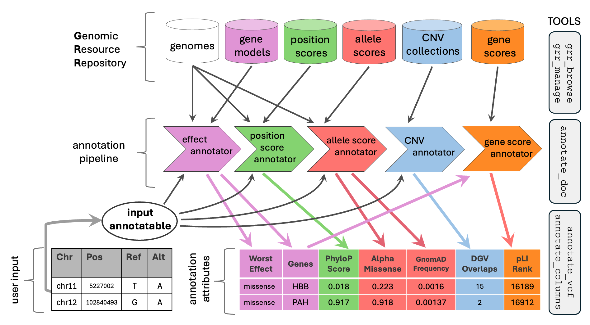

.. GAIn documentation master file, created by
   sphinx-quickstart on Thu Dec 18 10:54:14 2025.
   You can adapt this file completely to your liking, but it should at least
   contain the root `toctree` directive.

GAIn documentation
==================

Introduction
------------

Annotation is a core step in genomic analysis:
sequencing and other genomic assays identify variants, positions, or regions,
and annotation adds the biological and clinical context needed to interpret them. GAIn is an
infrastructure for running annotation in a consistent, reproducible way—by combining curated
resources (genomes, gene models, scores, gene sets, CNV collections, and plugins) with a user-defined annotation
pipeline that specifies what to compute and what to emit. This documentation walks through how to
use GAIn end to end: getting started on the web and the CLI, discovering and building Genomic Resource
Repositories (GRRs), configuring resources, writing and running annotation pipelines, and using the web
and Python interfaces.

    **Overview of GAIn**. Genomic resources (reference genomes, gene models, scores, CNV collections, gene scores) are organized in a Genomic Resource Repository (GRR). An annotation pipeline chains annotators that draw on these resources to produce an annotated table or VCF. The example highlights dependency flow: a gene score annotator consumes the gene list produced by the effect annotator. Right: core GAIn tools for GRR management (``grr_browse``, ``grr_manage``), pipeline documentation (``annotate_doc``), and annotation (``annotate_tabular``, ``annotate_vcf``).

A preprint describing GAIn is available on `bioRxiv <https://doi.org/10.64898/2026.07.08.737273>`_.

.. toctree::
    :maxdepth: 2
    :caption: Contents:

    gain_getting_started_web
    gain_getting_started_cli
    gain_getting_started_grr
    grr
    annotation_infrastructure
    web_interface
    plugin_library
    python_interface
    gain_development
    changes
