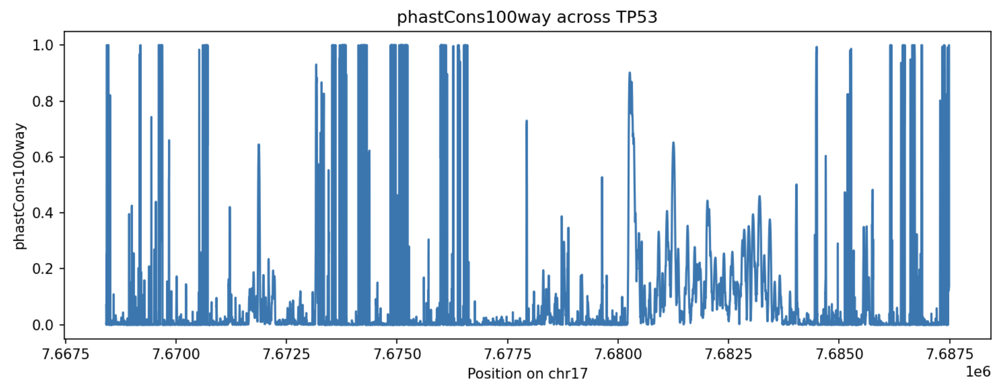

GAIn Python interface
======================

The command-line workflow is designed for specific GAIn tasks, such as annotating variants, positions, or regions 
and inspecting resources in a GRR. This covers many common annotation 
use cases. However, users may also want to ask more open-ended questions, such as summarizing 
the contents of a repository, querying a resource over a custom interval, combining information 
from several resources, or generating a custom plot. The Python interface supports these workflows 
by allowing users to access GRR resources directly and process the results using standard Python tools.

The first step is to connect to a Genomic Resource Repository (GRR). In the simplest case, a 
repository can be accessed without providing any arguments:

.. code-block:: python

    from gain.genomic_resources.repository_factory import build_genomic_resource_repository
    grr = build_genomic_resource_repository()

Calling ``build_genomic_resource_repository()`` without arguments uses the default GRR configuration available 
in the user environment. In a standard GAIn installation, the default configuration provides access to 
the public IossifovLab GRR. Users can also access local repositories or other public repositories by 
providing the repository definition explicitly. For example, the code below accesses the current 
working directory as a local GRR:

.. code-block:: python

    import os
    from gain.genomic_resources.repository_factory import build_genomic_resource_repository
    grr = build_genomic_resource_repository({
        "id": "local_grr",
        "type": "directory",
        "directory": os.getcwd(),
    })

After connecting to a repository, individual resources can be accessed using their resource IDs. 
For example, users can access a reference genome, a gene models resource, or a position score resource, 
and then call resource-specific methods on the resulting Python objects. This allows GRR resources to be 
queried directly in Python for custom analyses that are not part of a predefined annotation workflow.

The examples below illustrate three uses of the Python interface: inspecting chromosome lengths from a 
reference genome, locating a gene and retrieving scores across its interval, and summarizing the number 
of resources available for different genome builds. 
`GAIn development page <https://iossifovlab.com/gaindocs/gain_development.html>`_ provides more detail on the 
Python methods available for different resource types.

1: Chromosome lengths
^^^^^^^^^^^^^^^^^^^^^^^^^^^^

The following example shows how to access a reference genome and retrieve chromosome lengths for a selected 
set of canonical chromosomes (chromosomes 1-22, X, Y, and M).
First, the default GRR is accessed and a reference genome resource is retrieved using its resource ID. 
The script then defines a set of canonical chromosome names and iterates over the chromosomes available 
in the genome. For each chromosome that matches the canonical set, the chromosome length is retrieved 
and printed.

.. code-block:: python

    from gain.genomic_resources.repository_factory import build_genomic_resource_repository
    grr = build_genomic_resource_repository()

    from gain.genomic_resources.reference_genome import build_reference_genome_from_resource_id
    genome = build_reference_genome_from_resource_id("hg38/genomes/GRCh38-hg38", grr).open()

    # Define canonical chromosomes
    canonical_chroms = {f"chr{i}" for i in range(1, 23)}
    canonical_chroms.update(["chrX", "chrY", "chrM"])

    for chrom in genome.chromosomes:
        if chrom in canonical_chroms:
            print(chrom, genome.get_chrom_length(chrom))

Save this file as ``python_1.py``, and run it with:

.. code-block:: bash

    python python_1.py

The output lists the canonical chromosome names and their lengths for the ``hg38/genomes/GRCh38-hg38`` genome 
resource. The same chromosome lengths are reported in the 
`HTML summary page <https://grr.iossifovlab.com/hg38/genomes/GRCh38-hg38/index.html>`_ for this resource, 
allowing users to compare the Python output with the GAIn resource summary.

.. code-block:: text

    chr1 248956422
    chr2 242193529
    chr3 198295559
    chr4 190214555
    chr5 181538259
    chr6 170805979
    chr7 159345973
    chr8 145138636
    chr9 138394717
    chr10 133797422
    chr11 135086622
    chr12 133275309
    chr13 114364328
    chr14 107043718
    chr15 101991189
    chr16 90338345
    chr17 83257441
    chr18 80373285
    chr19 58617616
    chr20 64444167
    chr21 46709983
    chr22 50818468
    chrX 156040895
    chrY 57227415
    chrM 16569

2: Position scores across a gene
^^^^^^^^^^^^^^^^^^^^^^^^^^^^^^^^

This example shows how to retrieve and visualize position scores across a gene (e.g. TP53). 
The script uses the MANE 1.5 gene models resource (``hg38/gene_models/MANE/1.5``) to obtain 
the genomic coordinates of the primary transcript. It then queries the ``phastCons100way`` position 
score resource (hg38/scores/phastCons100way) across that interval to retrieve conservation scores. 
The scores are plotted over the TP53 region, with genomic position on the ``x-axis`` and the position 
score on the ``y-axis``, and the resulting figure is saved as ``TP53_phastCons100way.png`` in the current 
working directory. This example illustrates how gene models and position score resources can be 
combined to extract and visualize signal over a biologically meaningful region.

.. code-block:: python

    GENE_NAME = "TP53"

    from gain.genomic_resources.repository_factory import build_genomic_resource_repository
    grr = build_genomic_resource_repository()

    from gain.genomic_resources.gene_models import build_gene_models_from_resource_id
    gene_models = build_gene_models_from_resource_id("hg38/gene_models/MANE/1.5", grr).load()
    tx = gene_models.gene_models_by_gene_name(GENE_NAME)[0]
    chrom, start, end = tx.chrom, tx.tx[0], tx.tx[1]
    print(f"{GENE_NAME} is on {chrom}, from position {start} to {end}.")

    from gain.genomic_resources.genomic_scores import build_score_from_resource_id
    score = build_score_from_resource_id("hg38/scores/phastCons100way", grr).open()

    xs = []
    ys = []
    for pos_begin, pos_end, values in score.fetch_region(chrom, start, end):
        if values is not None:
            for p in range(pos_begin, pos_end + 1):
                xs.append(p)
                ys.append(values[0])

    import matplotlib.pyplot as plt
    plt.figure(figsize=(10, 4))
    plt.plot(xs, ys)
    plt.xlabel(f"Position on {chrom}")
    plt.ylabel("phastCons100way")
    plt.title(f"phastCons100way across {GENE_NAME}")
    plt.tight_layout()
    plt.savefig(f"{GENE_NAME}_phastCons100way.png", dpi=150)

Save this file as ``python_2.py``, and run it as before:

.. code-block:: bash

    python python_2.py

This will produce the following image:

In this plot, higher ``phastCons100way`` values indicate positions that are more conserved 
across the 100-way vertebrate alignment used by the resource. Peaks in the plot mark parts of 
the TP53 interval that are under stronger evolutionary constraint, while lower values indicate 
less conserved positions. This provides a compact view of how conservation varies across the TP53 locus.

3: Resource counts by genome
^^^^^^^^^^^^^^^^^^^^^^^^^^^^

This example summarizes how many resources of selected types are available for each genome build 
in the GRR. The script iterates over all resources, assigns each resource to a genome based on 
the prefix of its resource ID (e.g., ``hg19/``, ``hg38/``, ``hs1/``), filters by resource type, and counts 
how many resources of each type are present for each genome. The result is organized as a table (DataFrame).

.. code-block:: python

    import pandas as pd
    from collections import defaultdict
    from gain.genomic_resources.repository_factory import build_genomic_resource_repository

    grr = build_genomic_resource_repository()

    genomes = ["hg19", "hg38", "hs1"]
    types = ["genome", "gene_models", "position_score", "allele_score", "cnv_collection"]

    # initialize counts
    counts = {g: defaultdict(int) for g in genomes}

    for resource in grr.get_all_resources():
        rid = resource.get_id()
        rtype = resource.get_type()

        for g in genomes:
            if rid.startswith(f"{g}/") and rtype in types:
                counts[g][rtype] += 1

    # build dataframe
    df = pd.DataFrame(
        {g: [counts[g][t] for t in types] for g in genomes},
        index=types
    )

    df.index.name = "resource_type"
    print(df)

Save this file as ``python_3.py``, and run it as before:

.. code-block:: bash

    python python_3.py

The output is a table with resource types as rows and genome builds as columns, 
where each entry gives the number of resources of that type for the corresponding genome.

.. csv-table::
    :header-rows: 1

    resource_type,hg19,hg38,hs1
    genome,1,3,1
    gene_models,5,47,1
    position_score,152,8,0
    allele_score,5,31,0
    cnv_collection,0,7,0

4: Annotating variants in Python
^^^^^^^^^^^^^^^^^^^^^^^^^^^^^^^^

The previous examples accessed GRR resources directly. The Python interface can also be used to construct and run GAIn annotation pipelines without calling the command-line ``annotate_tabular`` or ``annotate_vcf`` tools. This is useful when variants are already available inside a Python script, notebook, or larger analysis workflow, and when users want to annotate them programmatically.

In this example, a small annotation pipeline is defined directly as a YAML string. The pipeline contains a single ``effect_annotator``, which uses the MANE 1.5 gene models resource to predict the effect of a variant. The variant is represented as a VCFAllele object, and the pipeline is then used to annotate that allele.

.. code-block:: python

    from gain.annotation.annotation_factory import load_pipeline_from_yaml
    from gain.annotation.annotatable import VCFAllele

    pipeline = load_pipeline_from_yaml("""
    - effect_annotator:
        gene_models: hg38/gene_models/MANE/1.5
    """, None)

    allele = VCFAllele("chr1", 11796321, "G", "A")

    result = pipeline.annotate(allele)
    batchresult = pipeline.batch_annotate([allele, allele])

    print(result)
    print(batch_result)

Save this file as ``python_4.py``, and run it as before:

.. code-block:: bash

    python python_4.py

This prints two outputs. The first output, ``result``, is the annotation result for one allele. It is produced by calling ``pipeline.annotate()``, which runs the pipeline on a single annotatable object.

.. code-block:: python

    {'worst_effect': 'missense', 'worst_effect_genes': 'MTHFR', 'gene_effects': 'MTHFR:missense', 'effect_details': 'ENST00000376590.9:MTHFR:missense:222/656(Ala->Val)', 'gene_list': ['MTHFR']}

The second output, ``batch_result``, is produced by calling ``pipeline.batch_annotate()``. This method takes a list of annotatable objects and returns annotation results for all of them. In this example, the same allele is provided twice, so the batch output contains two equivalent annotation results.

.. code-block:: python

    [{'worst_effect': 'missense', 'worst_effect_genes': 'MTHFR', 'gene_effects': 'MTHFR:missense', 'effect_details': 'ENST00000376590.9:MTHFR:missense:222/656(Ala->Val)', 'gene_list': ['MTHFR']}, {'worst_effect': 'missense', 'worst_effect_genes': 'MTHFR', 'gene_effects': 'MTHFR:missense', 'effect_details': 'ENST00000376590.9:MTHFR:missense:222/656(Ala->Val)', 'gene_list': ['MTHFR']}]

The output shows that the allele is annotated as a missense variant in MTHFR according to the MANE 1.5 gene models resource. In larger analyses, the same pattern can be extended by adding more annotators to the YAML pipeline, such as position scores, allele scores, or additional gene model resources. The annotate method is convenient for annotating one variant at a time, while batch_annotate is useful when many variants are processed inside the same Python workflow.
