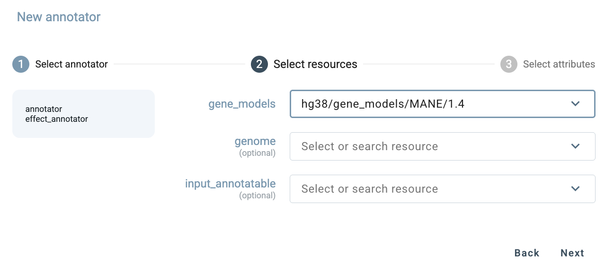
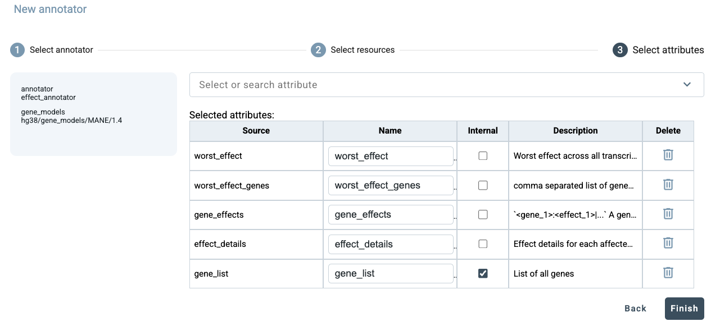
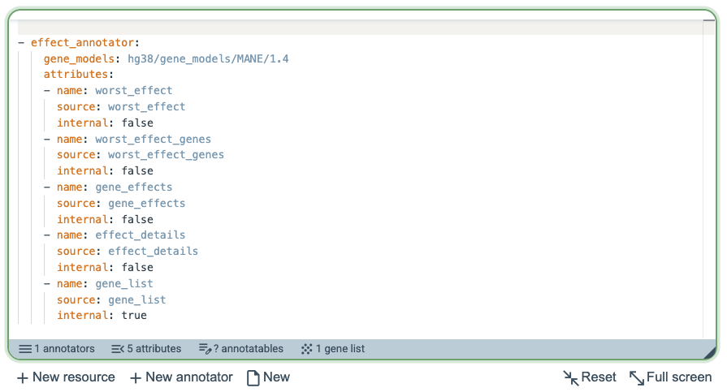
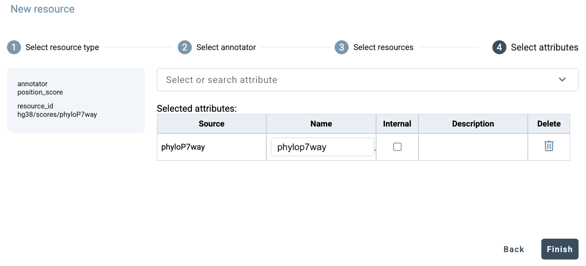
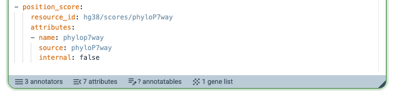
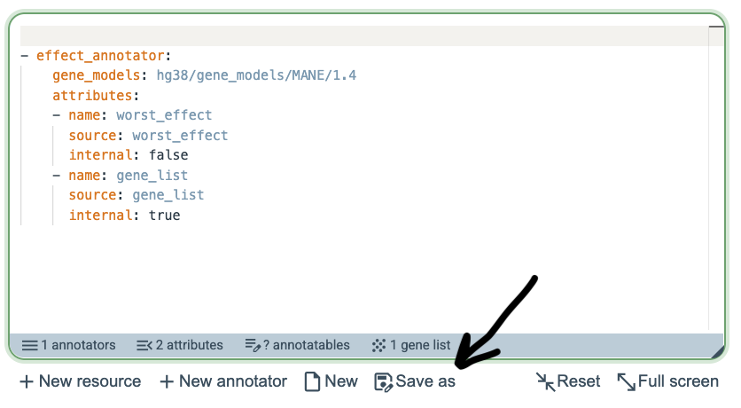

GAIn Web interface
==================

The Getting Started on the Web section demonstrated how to annotate variants, positions, or regions on the GAIn web 
interface using an existing saved pipeline, both for single-annotatable queries and for annotation jobs. 
This section covers the web interface in more detail, with an emphasis on creating custom annotation 
pipelines by adding annotators or resources, and on user-account features such as registration, saved 
pipelines, annotation history, and user quotas.

Create annotation pipelines
**************************

In the GAIn web interface (https://gain.iossifovlab.com/), the left side of the page contains the annotation 
pipeline editor. Saved annotation pipelines are displayed there and can be selected for immediate use. 
Clicking New at the bottom of the editor opens an empty pipeline definition for creating a custom annotation 
pipeline. In this initial empty state, the annotators and attributes panels at the bottom of the editor are 
empty, while the annotatables and gene list panels are not yet available. A custom pipeline can then be built 
either by adding annotators or by adding resources.

.. figure:: figures/web1.png

Add annotators
***************

To add a new annotator, click New annotator at the bottom of the annotation pipeline editor. This opens a 
three step dialog box in which the first step is to select the type of annotator to add. In this example, 
choose ``effect_annotator``.

.. figure:: figures/web2.png

Next, select the resource or resources that the annotator will use. Only resources compatible with the 
chosen annotator are shown in this step, and the search box can be used to filter the list. For ``effect_annotator``, 
compatible gene model resources are displayed. In this example, choose ``MANE/1.4``.

In the final step, select the attributes to be included in the annotation output. A default set of attributes 
is shown initially. Attributes can be removed using the buttons on the right, and any attribute can be marked 
as internal using the corresponding checkboxes. Additional attributes available from this annotator can also 
be found by using the search box at the top of the dialog. After making the desired selections, click Finish.

GAIn then generates the corresponding annotation pipeline definition and inserts it into the annotation 
pipeline editor using the correct syntax. The gray summary bar at the bottom of the editor shows the components 
currently present in the pipeline. In this example, the pipeline contains 1 annotator that produces 5 attributes. 
No annotatable has yet been defined, while 1 gene list is available for downstream use, representing the genes 
affected by the variant.

Next, add another annotator by clicking New annotator, which again opens the same three-step dialog. 
This time, select ``gene_score_annotator`` as the annotator type. Unlike annotators that operate directly on the input annotatable, a gene 
score annotator operates on genes rather than directly on the input annotatable. It therefore requires a gene 
list as input. In this example, that gene list is already available from the previously added ``effect_annotator``, 
which identified the genes affected by the annotatable. This illustrates how one annotator can produce information 
that is then used by a downstream annotator.

.. figure:: figures/web6.png

In the Select resources step, choose LGD scores as the resource. Then specify that the ``gene_list`` produced 
by the previously added ``effect_annotator`` should be used as the input gene list for this annotator.

.. figure:: figures/web7.png

In the final step, select the attributes to be generated by the annotator. In this example, remove LGD rank, keep only LGD score and click Finish.

.. figure:: figures/web8.png

GAIn then adds the ``gene_score_annotator`` to the annotation pipeline editor using the correct syntax, including the specification that the ``gene_list`` produced by the ``effect_annotator`` should be used as input for this annotator. The summary bar at the bottom of the editor is updated accordingly and now shows that the pipeline contains 2 annotators and 6 attributes.

.. figure:: figures/web9.png

Add resources
*****************

Instead of extending a pipeline by adding an annotator, users can also extend it by adding a resource. 
In this case, GAIn guides the user from the resource side and then shows the annotators that are 
compatible with the selected resource. To add a resource, click New resource at the bottom of the 
annotation pipeline editor. This opens a four-step dialog. In the first step, select the type of resource to add. 
In this example, choose position score and then among the available position scores, choose PhyloP7.

.. figure:: figures/web10.png

Since position score resources are used only by ``position_score_annotator``, 
GAIn skips the annotator-selection step in this case and proceeds directly to resource selection. 
Here, PhyloP7way is already selected, so click Next to continue to attribute selection. PhyloP7way provides 
only a single attribute, so click Finish to add this resource to the pipeline. 

The pipeline (only the bottom section is shown here) now has 3 annotators and produces 7 attributes.

Registration and user accounts
************************

The examples above show how a new annotation pipeline can be created directly in the GAIn web interface 
and used immediately for annotation. However, if the user leaves the page without saving, the newly 
created pipeline is lost. Registering for a GAIn account makes it possible to preserve this work and provides 
several additional conveniences.

One important benefit of registration is the ability to save pipelines by clicking Save as. 
This allows users to keep custom pipelines for later use, compare alternative versions of a pipeline, 
and iteratively refine pipeline definitions without having to recreate them from scratch. Saved pipelines 
are especially useful when testing different combinations of annotators, resources, and attributes.

Registration also allows annotation results to be retained in the user account. 
This applies both to single annotatable annotation and to annotation jobs. Once an annotation has been run, 
it appears in the user's history on the right side of the interface, making it possible to revisit earlier 
analyses, inspect their details, download previous results again, or rerun similar annotations without repeating 
the full setup.

.. figure:: figures/web14.png

.. figure:: figures/web15.png

In addition, registered accounts are associated with usage quotas for annotation jobs. At present, the maximum accepted input file size is 64 MB, 
and the maximum number of annotatables per job is 10,000. Each user may submit up to 50 annotation jobs per day and may use up to 
2 GB of storage space for saved data. These limits make it possible to support routine use of the web service while maintaining 
fair access across users.

