GAIn Web interface
==================

The Getting Started on the Web section demonstrated how to annotate variants, positions, or regions on the GAIn web 
interface using an existing saved pipeline, both for single-annotatable queries and for annotation jobs. 
This section covers the web interface in more detail, with an emphasis on creating custom annotation 
pipelines by adding annotators or resources, and on user-account features such as registration, saved 
pipelines, annotation history, and user quotas.

Create annotation pipelines
**************************

In the GAIn web interface (https://gain.iossifovlab.com/), the left side of the page contains the annotation 
pipeline editor. Saved annotation pipelines are displayed there and can be selected for immediate use. 
Clicking New at the bottom of the editor opens an empty pipeline definition for creating a custom annotation 
pipeline. In this initial empty state, the annotators and attributes panels at the bottom of the editor are 
empty, while the annotatables and gene list panels are not yet available. A custom pipeline can then be built 
either by adding annotators or by adding resources.

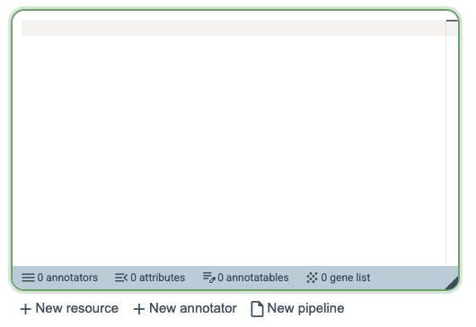

Add annotators
***************

To add a new annotator, click New annotator at the bottom of the annotation pipeline editor. This opens a four-step dialog, with an optional final aggregation step. In the **Select annotator** step, select the type of annotator to add from the drop-down menu. In this example, choose ``effect_annotator``.

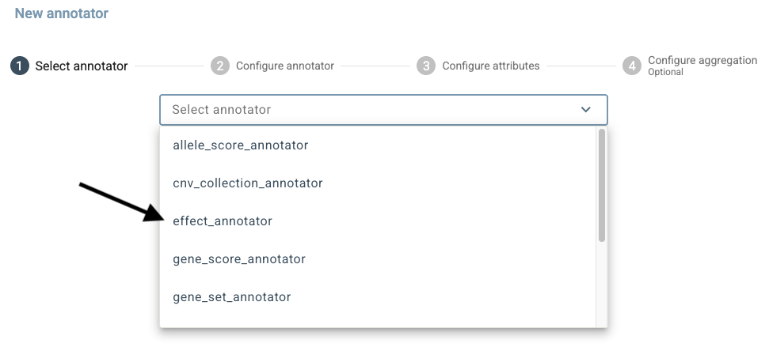

In the **Configure annotator** step, select the gene models resource that the ``effect_annotator`` will use. In this example, choose ``hg38/gene_models/MANE/1.5``. The genome to use for annotation can be specified in the genome field. Here, select ``hg38/genomes/GRCh38.p14`` and leave the optional ``input_annotatable`` field empty so that the annotator uses the input provided by the user.

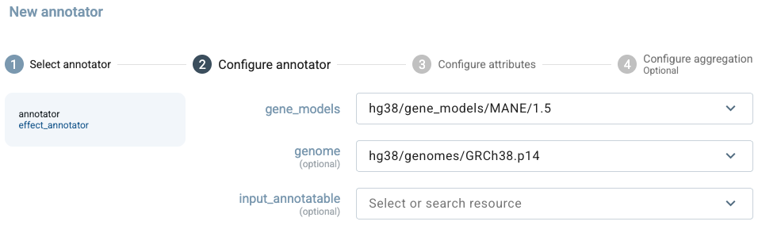

In the **Configure attributes** step, remove ``gene_effects`` and ``effect_details`` using the delete icons, leaving ``worst_effect``, ``worst_effect_genes``, and the internal ``gene_list`` attribute selected. Additional attributes can be browsed and added using the ``Select or search attribute`` box. In this example, we do not use the optional **Configure aggregation** step because effect annotations are not numerically aggregated. The only relevant setting is the separator used when multiple genes are returned in ``gene_list``. Click Finish to add the annotator to the pipeline.

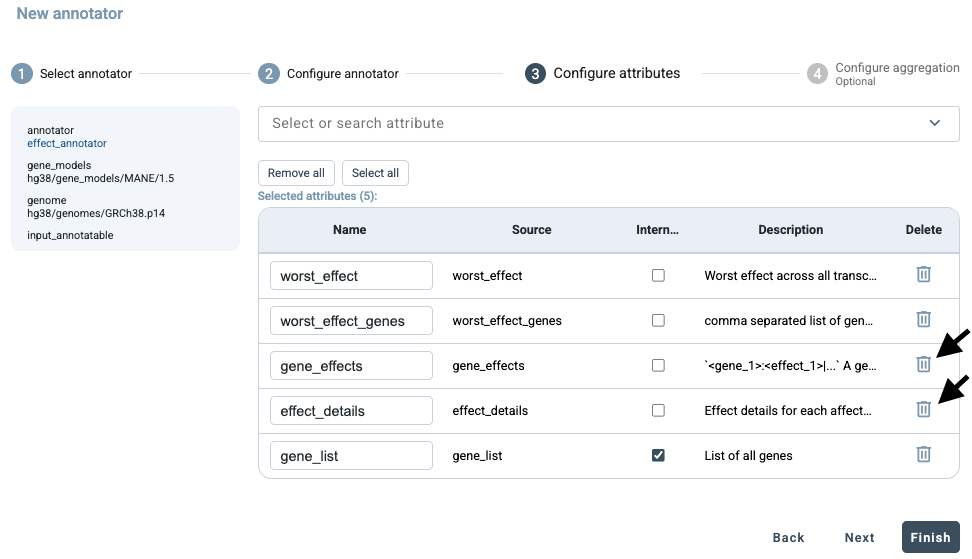

GAIn then generates the corresponding annotation pipeline definition and inserts it into the annotation pipeline editor using the correct syntax. The summary bar at the bottom of the editor shows the components currently present in the pipeline. In this example, the pipeline contains 1 annotator that produces 3 attributes. No annotatable has yet been defined, while 1 gene list is available for downstream use, representing the genes affected by the variant.

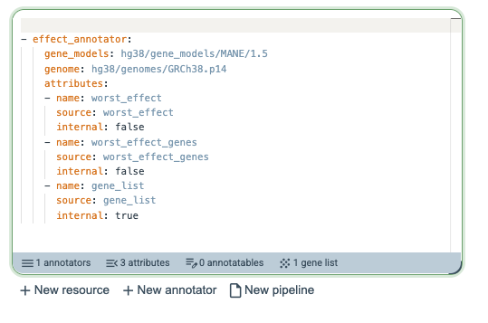

Next, add one more annotator by clicking **New annotator**, which opens the four-step dialog. Select ``gene_score_annotator`` as the annotator type. Unlike annotators that operate directly on the input annotatable, a gene score annotator operates on genes and therefore requires a gene list as input. In this example, the required ``gene_list`` is already available from the previously added ``effect_annotator``, which identified the genes affected by the input variant. We will use this gene list to add the LGD gene score in the following steps.

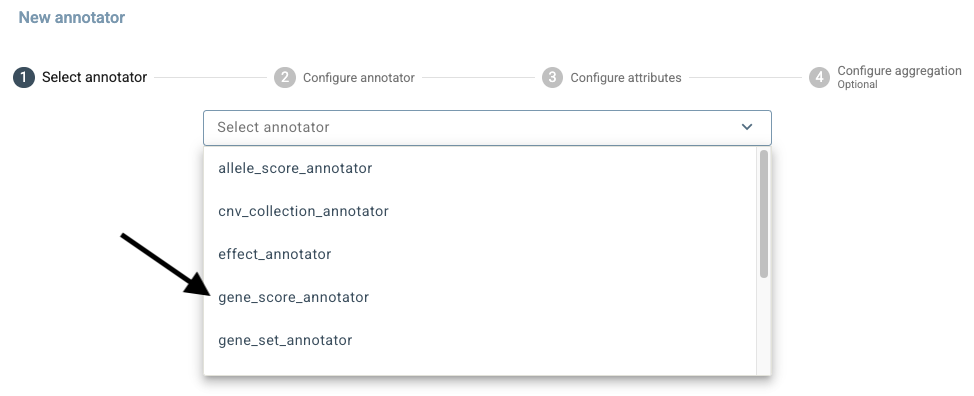

In the **Configure annotator** step, select ``gene_properties/gene_scores/LGD`` as the resource and set ``input_gene_list`` to the ``gene_list`` produced by the preceding ``effect_annotator``. This allows the annotator to retrieve LGD scores for the genes affected by the input variant.

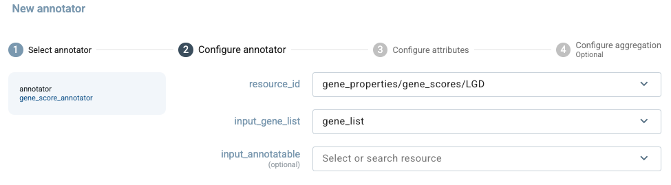

In the **Configure attributes** step, ``LGD_score`` and ``LGD_rank`` are selected by default. Remove ``LGD_rank`` using the delete icon and keep only ``LGD_score``. Then click Next to continue.

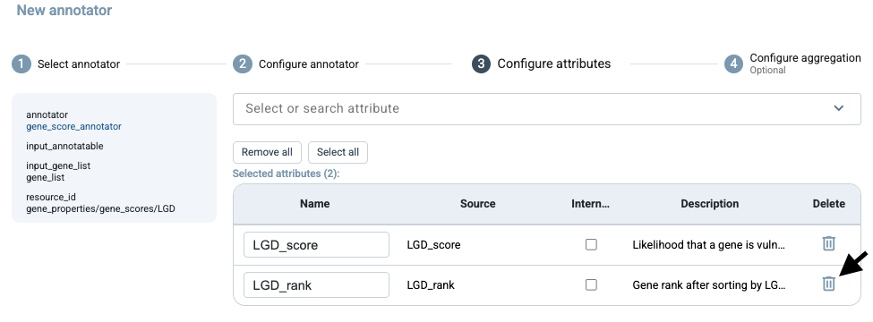

In the **Configure aggregation** step, several aggregation methods are available for ``LGD_score``. This setting is relevant only when the input is associated with two or more genes and therefore produces multiple LGD scores. Select the desired aggregation method, then click Finish to add the annotator to the pipeline.

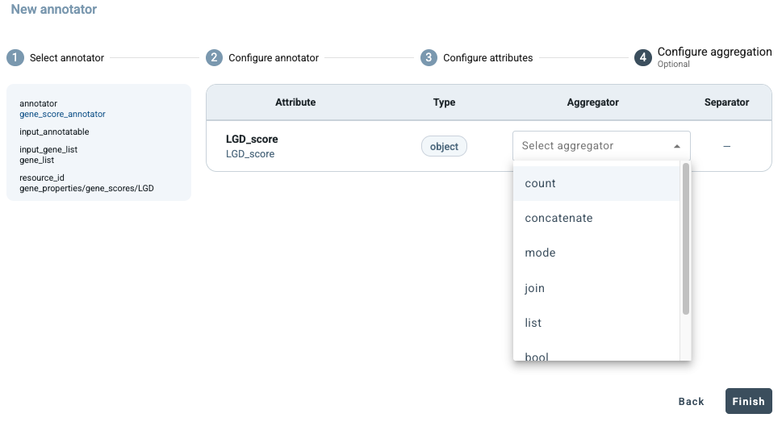

GAIn then adds the ``gene_score_annotator`` to the annotation pipeline editor using the correct syntax, including the specification that the ``gene_list`` produced by the ``effect_annotator`` should be used as input for this annotator. The summary bar at the bottom of the editor is updated accordingly and now shows that the pipeline contains 2 annotators and 6 attributes.

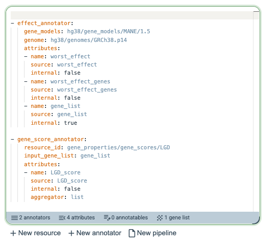

Add resources
*****************

Instead of extending a pipeline by adding an annotator, users can also extend it by adding a resource. In this case, GAIn guides the user from the resource side and then shows the annotators compatible with the selected resource. To add a resource, click **New resource** at the bottom of the annotation pipeline editor. This opens a five-step dialog, beginning with the **Select resource** step. Resources can be filtered by resource type using the drop-down menu or located using the search box. Each resource row provides three actions: the left icon opens the resource's GRR page, where detailed information about the resource can be viewed; the middle icon selects the resource and proceeds through the remaining configuration steps; and the rightmost check-mark icon accepts all default settings and adds the resource directly to the pipeline. For this example, locate ``MANE/1.5`` and click the middle icon to select it and continue.

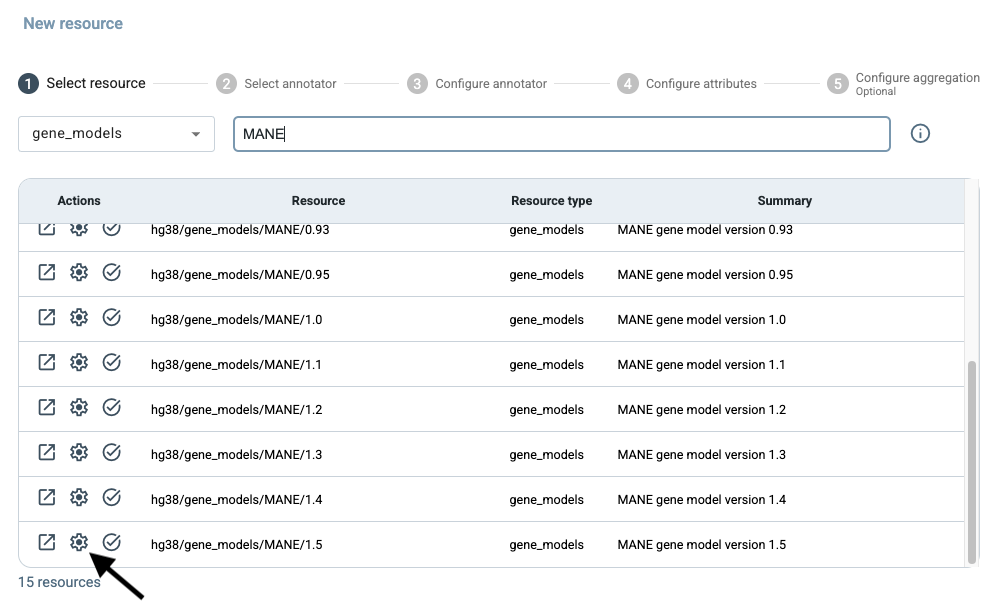

A gene models resource can be used by two types of effect annotators: ``effect_annotator`` and ``simple_effect_annotator``. In the **Select Annotator** step, select ``effect_annotator``, which provides more detailed consequence annotations, including the predicted effects of an allele change on transcripts and protein sequences.

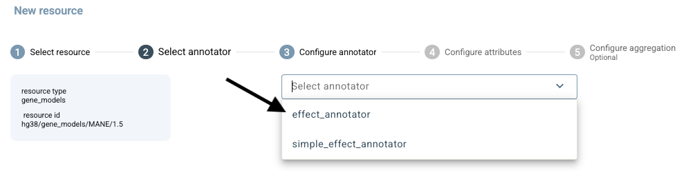

In the **Configure annotator** step, the selected gene models resource is shown automatically. A gene models resource may specify a reference genome through its ``reference_genome`` label, or a different genome resource can also be selected at this step. In this example, we select ``hg38/genomes/GRCh38.p14``. By default, ``input_annotatable`` refers to the annotatable provided directly by the user. Because this simple pipeline contains no alternative annotatables, leave this field empty.

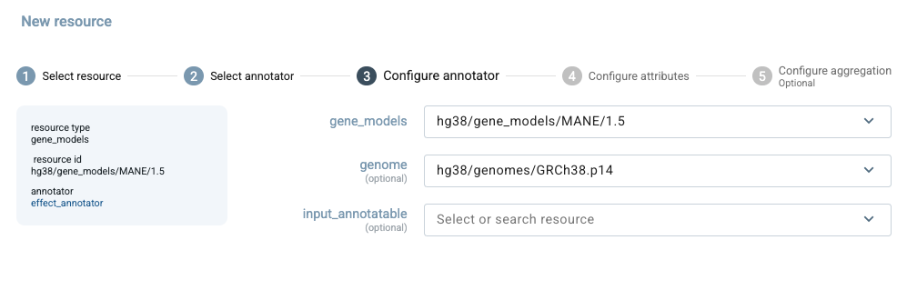

In the **Configure attributes** step, a default set of five attributes is selected for this resource type. ``worst_effect`` reports the most severe consequence, ``worst_effect_genes`` identifies the associated genes, gene_effects summarizes effects by gene, and ``effect_details`` provides further detail. ``gene_list`` contains the affected genes and is marked as internal so it can be passed to a downstream annotator, such as a ``gene_score_annotator``. Additional attributes can be found using the search box. Because gene models describe variant consequences rather than numerical values, aggregation does not apply. Click Finish to add the resource after this fourth step.

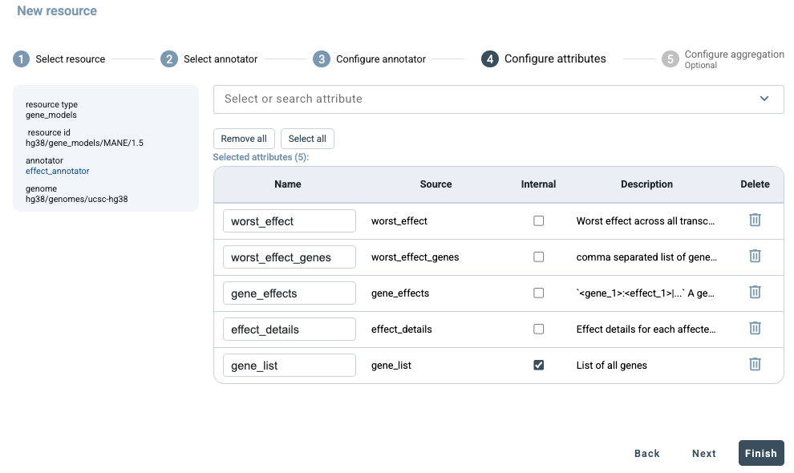

GAIn then adds the configured resource to the annotation pipeline as an effect_annotator using MANE/1.5 and the selected genome. The pipeline definition includes the five selected attributes, with gene_list marked as internal. The summary bar now shows 1 annotator, 5 attributes, and 1 gene list.

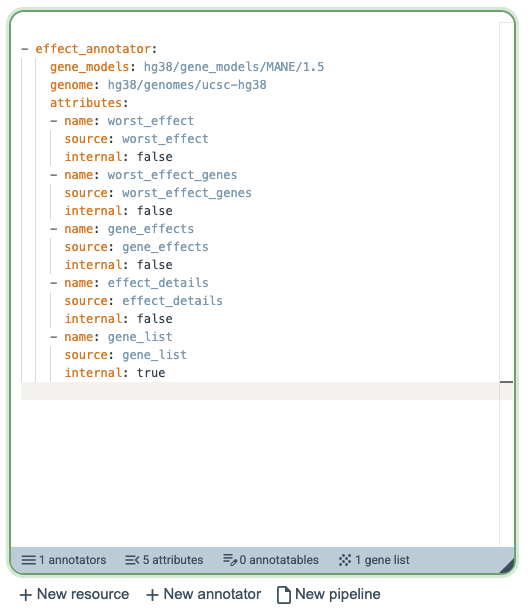

As another example, add the PhyloP7way position score resource and keep the default settings in the earlier configuration steps. This resource produces a single score attribute. In the **Configure aggregation** step, select max instead of the default mean. Aggregation affects only inputs that span more than one nucleotide. For a region, max reports the highest PhyloP score found within that region. Click Finish to add the resource with this configuration to the annotation pipeline.

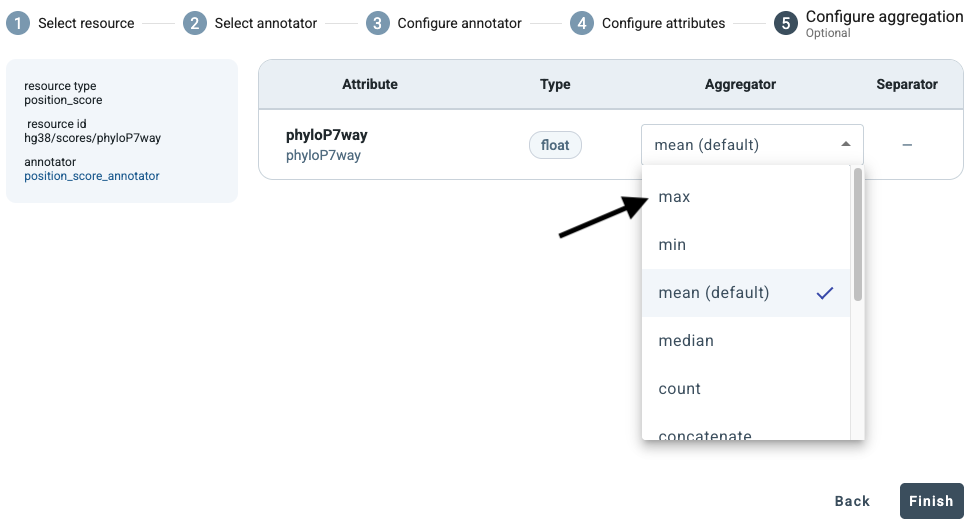

In the next example, we will add the MPC resource, which uses hg19 coordinates, while the input to this pipeline is in hg38 coordinates. First, add the ``liftover/hg38_to_hg19`` resource to the pipeline using the default configuration.

Next, add the hg19/scores/MPC allele score resource, which provides a pathogenicity score for missense variants. In the Configure annotator step, select liftover_annotatable as the input annotatable. If this field is left empty, GAIn uses the original hg38 input, which is incompatible with the hg19 resource. Using the lifted-over annotatable allows an hg38 input to be annotated with resources defined in hg19 coordinates.

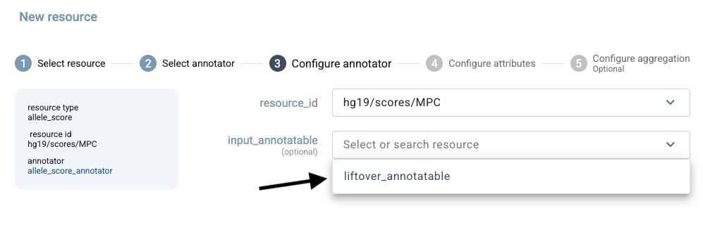

The completed pipeline is shown below. It contains 4 annotators and produces 8 attributes. It also provides 1 internal annotatable and 1 gene list for use by downstream annotators.

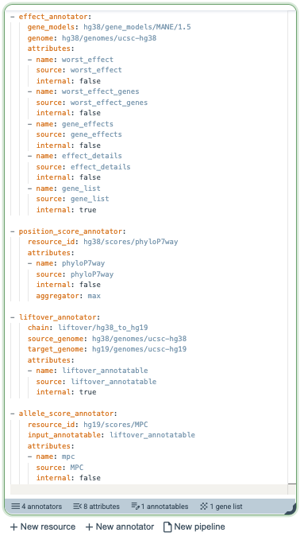

Registration and user accounts
************************

The examples above show how a new annotation pipeline can be created directly in the GAIn web interface 
and used immediately for annotation. However, if the user leaves the page without saving, the newly 
created pipeline is lost. Registering for a GAIn account makes it possible to preserve this work and provides 
several additional conveniences.

One important benefit of registration is the ability to save pipelines by clicking Save as. 
This allows users to keep custom pipelines for later use, compare alternative versions of a pipeline, 
and iteratively refine pipeline definitions without having to recreate them from scratch. Saved pipelines 
are especially useful when testing different combinations of annotators, resources, and attributes.

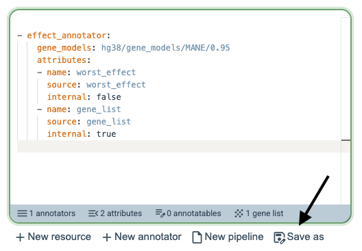

Registration also allows annotation results to be retained in the user account. This applies both to single annotatable annotation and to annotation jobs. Once an annotation has been run, it appears in the user's history on the right side of the interface, making it possible to revisit earlier analyses, inspect their details, download previous results again, or rerun similar annotations without repeating the full setup.

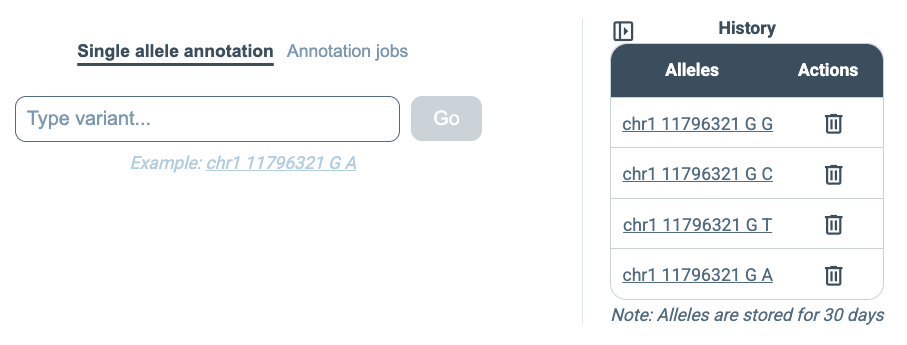

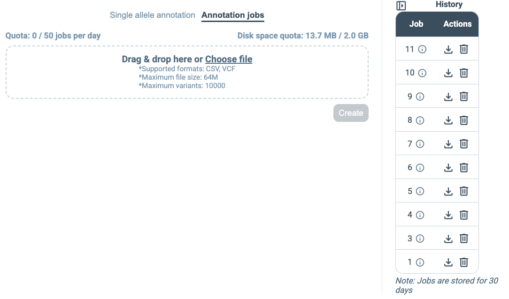

In addition, registered accounts are associated with usage quotas for annotation jobs. At present, the maximum accepted input file size is 64 MB, and the maximum number of annotatables per job is 10,000. Each user may submit up to 50 annotation jobs per day and may use up to 2 GB of storage space for saved data. These limits make it possible to support routine use of the web service while maintaining fair access across users.

